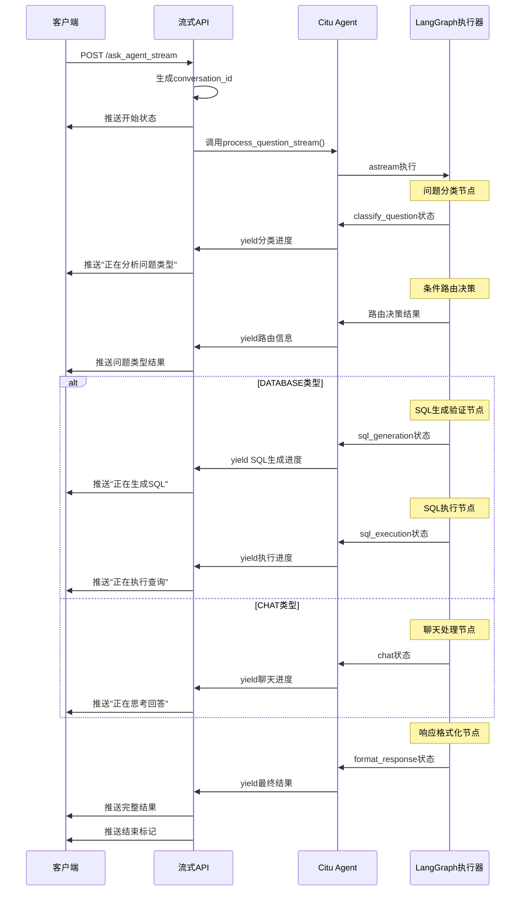

# Agent 流式API设计方案

## 概述

本文档描述了Citu LangGraph Agent流式状态监控API的设计方案，解决当前同步API无法显示执行进度的问题。通过新增流式API，在保持现有API不变的前提下，为客户端提供实时的业务查询处理状态监控能力。

## 背景问题

### 当前API的局限性

当前的 `ask_agent` API存在以下问题：

1. **同步执行**：客户端必须等待整个Agent执行完成
2. **无进度显示**：无法了解问题分类、SQL生成、查询执行等关键步骤的进度
3. **用户体验差**：复杂查询时长时间等待没有任何反馈
4. **调试困难**：开发者无法实时观察Agent的决策和执行过程

### 业务场景需求

- **复杂SQL生成**：表结构分析、SQL生成可能耗时较长
- **数据库查询监控**：大数据量查询需要执行进度反馈
- **错误及时反馈**：SQL验证失败、执行异常需要立即通知
- **分类决策透明**：让用户了解系统如何判断问题类型

## 解决方案

### 设计原则

1. **向后兼容**：现有 `ask_agent` API保持完全不变
2. **业务导向**：重点关注SQL生成、执行等高价值业务环节
3. **统一格式**：与现有API保持相同的响应格式
4. **实时性**：基于LangGraph原生的流式能力
5. **调试友好**：提供丰富的执行状态信息

### 技术方案

#### 1. 新增流式API

**端点**：`POST /api/v0/ask_agent_stream`

**技术栈**：
- 基于 LangGraph 的 `astream` 功能
- 使用 Server-Sent Events (SSE) 推送状态
- 复用现有的所有业务逻辑和错误处理

#### 2. 执行流程



## 实现方案

### 1. 修改 `agent/citu_agent.py`

**新增方法**：`process_question_stream()`

```python
async def process_question_stream(self, question: str, conversation_id: str = None, 
                                context_type: str = None, routing_mode: str = None):
    """
    流式处理用户问题 - 复用process_question()的所有逻辑
    """
    try:
        # 1. 复用现有的初始化逻辑
        if not conversation_id:
            conversation_id = self._generate_conversation_id()
        
        # 2. 动态创建workflow（复用现有逻辑）
        workflow = self._create_workflow(routing_mode)
        
        # 3. 创建初始状态（复用现有逻辑）
        initial_state = self._create_initial_state(question, conversation_id, context_type, routing_mode)
        
        # 4. 使用astream流式执行
        async for chunk in workflow.astream(
            initial_state,
            config={"configurable": {"conversation_id": conversation_id}} if conversation_id else None
        ):
            for node_name, node_data in chunk.items():
                # 映射节点状态为用户友好的进度信息
                progress_info = self._map_node_to_progress(node_name, node_data)
                if progress_info:
                    yield {
                        "type": "progress",
                        "node": node_name,
                        "progress": progress_info,
                        "state_data": self._extract_relevant_state(node_data),
                        "conversation_id": conversation_id
                    }
        
        # 5. 最终结果处理（复用现有的结果提取逻辑）
        final_result = node_data.get("final_response", {})
        yield {
            "type": "completed",
            "result": final_result,
            "conversation_id": conversation_id
        }
        
    except Exception as e:
        yield {
            "type": "error", 
            "error": str(e),
            "conversation_id": conversation_id
        }
```

**关键特性**：
- 完全复用现有的工作流创建和状态管理逻辑
- 使用 `astream` 而非 `ainvoke` 获取每个节点状态
- 通过生成器模式实时yield状态信息
- 保持所有现有的错误处理和业务逻辑

### 2. 修改 `unified_api.py`

**新增API端点**：`ask_agent_stream()`

```python
@app.route("/api/v0/ask_agent_stream", methods=["POST"])
async def ask_agent_stream():
    """Citu Agent 流式API"""
    
    async def generate():
        try:
            # 复用现有的数据验证逻辑
            data = request.get_json(force=True)
            validated_data = validate_agent_request_data(data)
            
            # 复用现有的Agent初始化检查
            if not await ensure_agent_ready():
                yield format_error_event("Agent服务不可用")
                return
            
            # 流式执行
            async for chunk in _agent_instance.process_question_stream(
                question=validated_data['question'],
                conversation_id=validated_data.get('conversation_id'),
                context_type=validated_data.get('context_type'),
                routing_mode=validated_data.get('routing_mode')
            ):
                if chunk["type"] == "progress":
                    yield format_progress_event(chunk)
                elif chunk["type"] == "completed":
                    yield format_completion_event(chunk, validated_data)
                elif chunk["type"] == "error":
                    yield format_error_event(chunk["error"])
            
        except Exception as e:
            yield format_exception_event(e)
    
    return Response(generate(), mimetype='text/event-stream')
```

### 3. 节点状态映射设计

#### 核心节点监控

| 节点名称 | 显示名称 | 图标 | 业务价值 | 监控重点 |
|----------|----------|------|----------|----------|
| `classify_question` | 分析问题类型 | 🤔 | ⭐⭐⭐ | 分类结果、置信度、路由模式 |
| `agent_sql_generation` | 生成SQL查询 | 🔧 | ⭐⭐⭐⭐⭐ | SQL生成成功/失败、验证结果 |
| `agent_sql_execution` | 执行数据查询 | ⚙️ | ⭐⭐⭐⭐⭐ | 查询进度、结果行数、摘要生成 |
| `agent_chat` | 思考回答 | 💭 | ⭐⭐⭐ | 聊天处理进度 |
| `format_response` | 整理结果 | 📝 | ⭐⭐ | 最终格式化进度 |

#### 条件路由监控

```python
def _map_node_to_progress(self, node_name: str, node_data: dict) -> dict:
    """将节点执行状态映射为用户友好的进度信息"""
    
    if node_name == "classify_question":
        question_type = node_data.get("question_type", "UNCERTAIN")
        confidence = node_data.get("classification_confidence", 0)
        return {
            "display_name": "分析问题类型",
            "icon": "🤔",
            "details": f"问题类型: {question_type} (置信度: {confidence:.2f})",
            "sub_status": f"使用{node_data.get('classification_method', '未知')}方法分类"
        }
    
    elif node_name == "agent_sql_generation":
        if node_data.get("sql_generation_success"):
            return {
                "display_name": "SQL生成成功",
                "icon": "✅",
                "details": f"生成SQL: {node_data.get('sql', '')[:50]}...",
                "sub_status": "验证通过，准备执行"
            }
        else:
            error_type = node_data.get("validation_error_type", "unknown")
            return {
                "display_name": "SQL生成处理中",
                "icon": "🔧",
                "details": f"验证状态: {error_type}",
                "sub_status": node_data.get("user_prompt", "正在处理")
            }
    
    elif node_name == "agent_sql_execution":
        query_result = node_data.get("query_result", {})
        row_count = query_result.get("row_count", 0)
        return {
            "display_name": "执行数据查询", 
            "icon": "⚙️",
            "details": f"查询完成，返回 {row_count} 行数据",
            "sub_status": "正在生成摘要" if row_count > 0 else "查询执行完成"
        }
    
    elif node_name == "agent_chat":
        return {
            "display_name": "思考回答",
            "icon": "💭", 
            "details": "正在处理您的问题",
            "sub_status": "使用智能对话模式"
        }
    
    elif node_name == "format_response":
        return {
            "display_name": "整理结果",
            "icon": "📝",
            "details": "正在格式化响应结果",
            "sub_status": "即将完成"
        }
    
    return None
```

### 4. 响应格式设计

#### 进度状态消息

```json
{
  "code": 200,
  "success": true,
  "message": "正在执行: 分析问题类型",
  "data": {
    "type": "progress",
    "node": "classify_question",
    "display_name": "分析问题类型",
    "icon": "🤔",
    "details": "问题类型: DATABASE (置信度: 0.85)",
    "sub_status": "使用hybrid方法分类",
    "conversation_id": "citu_20250131103000001",
    "timestamp": "2025-01-31T10:30:05",
    "state_summary": {
      "current_step": "classified",
      "execution_path": ["start", "classify"],
      "routing_mode": "hybrid"
    }
  }
}
```

#### 最终结果消息

```json
{
  "code": 200,
  "success": true,
  "message": "处理完成",
  "data": {
    "type": "completed",
    "response": "根据查询结果，服务区营业收入...",
    "type": "DATABASE",
    "sql": "SELECT service_area, SUM(revenue) FROM ...",
    "query_result": {
      "columns": [...],
      "rows": [...],
      "row_count": 25
    },
    "summary": "查询到25个服务区的营业数据...",
    "conversation_id": "citu_20250131103000001",
    "execution_path": ["start", "classify", "agent_sql_generation", "agent_sql_execution", "format_response"],
    "classification_info": {
      "question_type": "DATABASE",
      "confidence": 0.85,
      "method": "rule_based_strong_business"
    },
    "timestamp": "2025-01-31T10:30:15"
  }
}
```

#### 错误状态消息

```json
{
  "code": 500,
  "success": false,
  "message": "SQL验证失败",
  "data": {
    "type": "error",
    "error": "不允许的操作: DELETE。本系统只支持查询操作(SELECT)。",
    "error_type": "forbidden_keywords",
    "conversation_id": "citu_20250131103000001",
    "node": "agent_sql_generation",
    "timestamp": "2025-01-31T10:30:10",
    "state_summary": {
      "sql": "DELETE FROM sales WHERE...",
      "validation_error_type": "forbidden_keywords"
    }
  }
}
```

## 前端集成

### 现有API（保持不变）

```javascript
// 同步方式 - 适合简单查询场景
const response = await fetch('/api/v0/ask_agent', {
    method: 'POST',
    headers: {'Content-Type': 'application/json'},
    body: JSON.stringify({question, user_id})
});

const result = await response.json();
displayResult(result.data);
```

### 流式API

```javascript
// 流式方式 - 适合复杂查询和需要进度显示的场景
const eventSource = new EventSource('/api/v0/ask_agent_stream', {
    method: 'POST',
    headers: {'Content-Type': 'application/json'},
    body: JSON.stringify({question, user_id})
});

let conversationId = null;

eventSource.onmessage = function(event) {
    const data = JSON.parse(event.data);
    
    switch(data.data.type) {
        case 'progress':
            // 显示执行进度
            updateProgress(
                `${data.data.icon} ${data.data.display_name}`,
                data.data.details,
                data.data.sub_status
            );
            
            // 特殊处理关键节点
            if (data.data.node === 'classify_question') {
                showClassificationResult(data.data.state_summary);
            } else if (data.data.node === 'agent_sql_generation') {
                if (data.data.details.includes('SQL生成成功')) {
                    showSQL(data.data.state_summary.sql);
                }
            }
            
            if (!conversationId) conversationId = data.data.conversation_id;
            break;
            
        case 'completed':
            hideProgress();
            displayResult(data.data);  // 格式与现有API完全一致
            eventSource.close();
            break;
            
        case 'error':
            hideProgress();
            showError(data.message, data.data.error_type);
            eventSource.close();
            break;
    }
};

// 错误处理
eventSource.onerror = function(event) {
    hideProgress();
    showError("连接异常，请重试");
    eventSource.close();
};
```

## API测试

### Postman测试流式API

**Postman完全支持测试SSE流式API**：

#### 测试配置

1. **Method**: `POST`
2. **URL**: `http://localhost:8084/api/v0/ask_agent_stream`
3. **Headers**:
   ```
   Content-Type: application/json
   Accept: text/event-stream
   ```
4. **Body** (JSON):
   ```json
   {
     "question": "查询各服务区的营业收入排行",
     "user_id": "test_user",
     "routing_mode": "hybrid"
   }
   ```

#### 预期响应

Postman会逐步显示流式响应：

```
data: {"code":200,"success":true,"message":"正在执行: 分析问题类型","data":{"type":"progress","display_name":"分析问题类型","icon":"🤔"}}

data: {"code":200,"success":true,"message":"正在执行: 生成SQL查询","data":{"type":"progress","display_name":"生成SQL查询","icon":"🔧"}}

data: {"code":200,"success":true,"message":"正在执行: 执行数据查询","data":{"type":"progress","display_name":"执行数据查询","icon":"⚙️"}}

data: {"code":200,"success":true,"message":"处理完成","data":{"type":"completed","response":"...","conversation_id":"citu_20250131..."}}
```

#### 测试要点

**适合测试**：
- ✅ SSE格式正确性
- ✅ 节点状态转换序列
- ✅ 错误处理（SQL验证失败等）
- ✅ 不同路由模式的执行路径
- ✅ 分类决策和置信度

**特殊测试场景**：
- 🔧 SQL生成失败场景
- ⚙️ 数据库连接异常场景  
- 🤔 问题分类边界情况
- 💭 聊天类型问题处理

## 技术优势

### 1. 业务价值最大化

- **复杂查询可视化**：SQL生成、验证、执行全程可见
- **智能分类透明化**：用户了解系统如何判断问题类型
- **错误及时反馈**：SQL验证失败立即通知，不用等待整个流程
- **调试友好**：开发者可实时观察Agent决策过程

### 2. 技术架构优势

- **零风险改造**：现有API完全不变，新功能独立部署
- **代码复用最大化**：所有业务逻辑、错误处理完全复用
- **状态管理完善**：`AgentState` 天然适合流式监控
- **性能影响最小**：流式执行不增加计算开销

### 3. 用户体验提升

- **进度可视化**：关键业务步骤实时显示
- **智能等待**：用户知道系统在做什么，减少焦虑
- **错误友好**：问题分类、SQL验证错误立即显示
- **调试便利**：执行路径、状态变更全程记录

## 实施计划

### 阶段1：核心功能开发（1-2周）
- [ ] 在 `CituLangGraphAgent` 中新增 `process_question_stream()` 方法
- [ ] 在 `unified_api.py` 中新增流式API端点
- [ ] 实现节点状态映射和响应格式化
- [ ] 基础错误处理和异常捕获

### 阶段2：业务逻辑完善（1周）
- [ ] 完善SQL生成/验证/修复的流式监控
- [ ] 实现分类决策的详细状态推送
- [ ] 优化聊天类型问题的进度显示
- [ ] 添加条件路由的状态推送

### 阶段3：测试验证（1周）
- [ ] 单元测试：验证流式方法的正确性
- [ ] 集成测试：验证API端到端功能
- [ ] 业务场景测试：复杂SQL、分类边界、错误处理
- [ ] 性能测试：验证流式推送性能影响

### 阶段4：文档和部署（0.5周）
- [ ] 更新API文档和使用示例
- [ ] 前端集成指南和最佳实践
- [ ] 生产环境部署和监控配置

## 风险评估

### 低风险
- **现有功能影响**：新增功能，现有API完全不变
- **代码质量**：大量复用现有逻辑，经过验证的业务代码
- **部署复杂度**：仅需要API层面的更新

### 需要注意
- **异步处理**：确保所有节点的异步调用正确处理
- **状态一致性**：确保流式状态与最终结果一致
- **资源管理**：长连接的资源清理和超时处理
- **错误传播**：确保节点内部错误正确传递到流式API

### 监控要点
- **连接数监控**：SSE长连接数量和持续时间
- **节点执行时间**：各个节点的执行耗时分布
- **错误率统计**：不同类型错误的发生频率
- **用户体验指标**：完整流程的端到端耗时

## 总结

本方案通过新增流式API的方式，在保持现有系统稳定性的前提下，为Citu LangGraph Agent提供了实时状态监控能力。方案具有以下特点：

1. **业务价值最大化**：重点关注SQL生成、执行等高价值环节
2. **技术实现可靠**：基于LangGraph原生流式能力，复用所有现有逻辑
3. **用户体验优秀**：提供类似ChatGPT的实时反馈体验
4. **维护成本低**：统一的响应格式和错误处理机制

该方案为Agent系统的用户体验升级提供了完整的技术解决方案，特别适合处理复杂业务查询的场景。

---

*本文档描述了Citu LangGraph Agent流式API的完整设计方案，为实际开发提供详细的技术规范。*