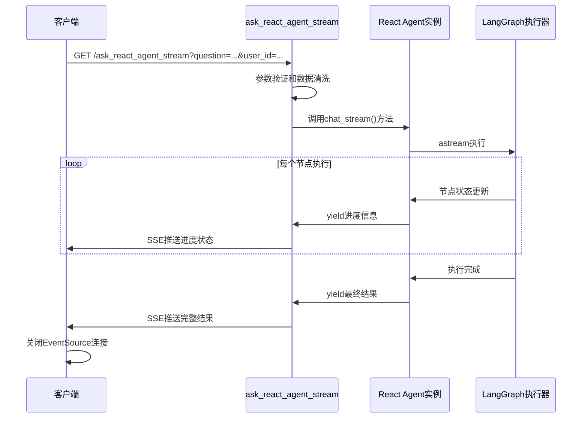

# React Agent 流式API设计方案 (ask_react_agent_stream)

## 概述

本文档描述了为React Agent添加流式API `ask_react_agent_stream` 的设计方案，该API与现有的 `ask_react_agent` 功能和参数完全相同，但采用流式输出模式。设计参考了现有的 `ask_agent_stream` 实现模式，确保系统的一致性和稳定性。

## 背景与需求

### 现有API局限性

当前的 `ask_react_agent` API 存在以下问题：
1. **同步执行**：客户端必须等待完整的React Agent执行完成
2. **无进度反馈**：客户端无法了解LangGraph各节点的执行状态
3. **用户体验差**：长时间执行没有实时反馈

### 解决目标

- 提供与 `ask_react_agent` 相同的功能和参数
- 支持实时显示LangGraph节点执行进度
- 采用SSE（Server-Sent Events）流式推送
- 完全不影响现有 `ask_react_agent` API的功能

## 技术方案

### 1. API设计

**端点**: `GET /api/v0/ask_react_agent_stream`

**参数获取方式**: URL查询参数（因为EventSource只支持GET请求）

**支持参数**:
- `question` (必填): 用户问题
- `user_id` (可选): 用户ID，默认为"guest"或从thread_id推断
- `thread_id` (可选): 会话ID，不传则自动生成新会话

**响应格式**: `text/event-stream` (SSE格式)

### 2.1 同步版本API (推荐用于复杂数据库查询)

**端点**: `GET /api/v0/ask_react_agent_stream_sync`

**设计目的**: 解决Vector搜索异步冲突问题，专门用于复杂数据库查询

**参数**: 与原API完全相同
- `question` (必填): 用户问题
- `user_id` (必填): 用户ID
- `thread_id` (可选): 会话ID，不传则自动生成新会话
- `routing_mode` (可选): 路由模式，默认'agent'
- `continue_conversation` (可选): 是否继续对话，默认false

**技术架构**: 
- 使用同步LangGraph (`invoke()` 而不是 `ainvoke()`)
- 同步LLM配置 (`streaming=False`, `enable_thinking=False`)
- 完全避免异步依赖冲突

**适用场景**:
- ✅ 复杂数据库查询
- ✅ 需要Vector搜索的问题
- ✅ 对稳定性要求高的场景

**使用示例**:
```bash
curl -X GET "http://localhost:8084/api/v0/ask_react_agent_stream_sync?question=请问当前系统中哪个服务区档口最多?&user_id=test_user" -H "Accept: text/event-stream"
```

### 2. 实现架构



### 3. 核心实现逻辑

#### 3.1 API端点实现

```python
@app.route('/api/v0/ask_react_agent_stream', methods=['GET'])
async def ask_react_agent_stream():
    """React Agent 流式API - 支持实时进度显示
    功能与ask_react_agent完全相同，除了采用流式输出
    """
    def generate():
        try:
            # 1. 参数获取和验证（从URL参数）
            question = request.args.get('question')
            user_id_input = request.args.get('user_id')
            thread_id_input = request.args.get('thread_id')
            
            # 参数验证（复用现有validate_request_data逻辑）
            if not question:
                yield format_sse_error("缺少必需参数：question")
                return
                
            # 2. 数据预处理（与ask_react_agent相同）
            validated_data = validate_request_data({
                'question': question,
                'user_id': user_id_input,
                'thread_id': thread_id_input
            })
            
            # 3. Agent实例检查
            if not await ensure_agent_ready():
                yield format_sse_error("React Agent 初始化失败")
                return
            
            # 4. 流式执行
            async for chunk in _react_agent_instance.chat_stream(
                message=validated_data['question'],
                user_id=validated_data['user_id'],
                thread_id=validated_data['thread_id']
            ):
                if chunk["type"] == "progress":
                    yield format_sse_react_progress(chunk)
                elif chunk["type"] == "completed":
                    yield format_sse_react_completed(chunk)
                elif chunk["type"] == "error":
                    yield format_sse_error(chunk.get("error", "处理失败"))
                    
        except Exception as e:
            yield format_sse_error(f"服务异常: {str(e)}")
    
    return Response(stream_with_context(generate()), mimetype='text/event-stream')
```

#### 3.2 React Agent流式方法

需要在React Agent类中新增 `chat_stream()` 方法：

```python
async def chat_stream(self, message: str, user_id: str, thread_id: Optional[str] = None):
    """
    流式处理用户聊天请求 - 复用chat()方法的所有逻辑
    """
    # 1. 复用现有的初始化逻辑（thread_id生成、配置检查等）
    if not thread_id:
        now = pd.Timestamp.now()
        milliseconds = int(now.microsecond / 1000)
        thread_id = f"{user_id}:{now.strftime('%Y%m%d%H%M%S')}{milliseconds:03d}"
    
    # 2. 复用现有的配置和错误处理
    self._recursion_count = 0
    run_config = {
        "configurable": {"thread_id": thread_id},
        "recursion_limit": config.RECURSION_LIMIT
    }
    
    # 3. 复用checkpointer检查逻辑
    if self.checkpointer:
        # ... checkpointer连接检查和重新初始化 ...
    
    # 4. 使用astream流式执行
    final_state = None
    async for chunk in self.agent_executor.astream(inputs, run_config, stream_mode="updates"):
        for node_name, node_data in chunk.items():
            yield {
                "type": "progress",
                "node": node_name,
                "data": node_data,
                "thread_id": thread_id
            }
            final_state = node_data
    
    # 5. 复用现有的结果处理逻辑
    if final_state and "messages" in final_state:
        api_data = await self._async_generate_api_data(final_state)
        yield {
            "type": "completed",
            "result": {"api_data": api_data, "thread_id": thread_id}
        }
```

### 4. SSE响应格式设计

#### 4.1 进度状态消息

```json
{
  "code": 200,
  "success": true,
  "message": "正在执行: AI思考中",
  "data": {
    "type": "progress",
    "node": "agent",
    "display_name": "AI思考中",
    "thread_id": "wang1:20250131103000001",
    "timestamp": "2025-01-31T10:30:00.123Z"
  }
}
```

#### 4.2 最终结果消息

```json
{
  "code": 200,
  "success": true,
  "message": "处理完成",
  "data": {
    "type": "completed",
    "response": "根据销售数据分析...",
    "conversation_id": "wang1:20250131103000001",
    "user_id": "wang1",
    "react_agent_meta": {
      "thread_id": "wang1:20250131103000001",
      "agent_version": "custom_react_v1_async"
    },
    "sql": "SELECT * FROM sales...",
    "records": [...],
    "timestamp": "2025-01-31T10:32:15.456Z"
  }
}
```

#### 4.3 错误消息

```json
{
  "code": 500,
  "success": false,
  "message": "处理失败",
  "data": {
    "type": "error",
    "error": "具体错误信息",
    "timestamp": "2025-01-31T10:30:05.789Z"
  }
}
```

### 5. 节点状态映射

基于LangGraph的节点执行，提供用户友好的状态显示：

| 节点名称 | 显示名称 | 说明 |
|----------|----------|------|
| `__start__` | 开始处理 | 流程启动 |
| `trim_messages` | 准备消息 | 消息预处理 |
| `agent` | AI思考中 | LLM推理决策 |
| `prepare_tool_input` | 准备工具 | 工具输入准备 |
| `tools` | 执行查询 | SQL工具执行 |
| `update_state_after_tool` | 处理结果 | 结果后处理 |
| `format_final_response` | 生成回答 | 最终响应格式化 |
| `__end__` | 完成 | 流程结束 |

### 6. SSE格式化函数

#### 6.1 进度格式化

```python
def format_sse_react_progress(chunk: dict) -> str:
    """格式化React Agent进度事件为SSE格式"""
    node = chunk.get("node")
    thread_id = chunk.get("thread_id")
    
    # 节点显示名称映射
    node_display_map = {
        "__start__": "开始处理",
        "trim_messages": "准备消息", 
        "agent": "AI思考中",
        "prepare_tool_input": "准备工具",
        "tools": "执行查询",
        "update_state_after_tool": "处理结果",
        "format_final_response": "生成回答",
        "__end__": "完成"
    }
    
    display_name = node_display_map.get(node, "处理中")
    
    data = {
        "code": 200,
        "success": True,
        "message": f"正在执行: {display_name}",
        "data": {
            "type": "progress",
            "node": node,
            "display_name": display_name,
            "thread_id": thread_id,
            "timestamp": datetime.now().isoformat()
        }
    }
    
    import json
    return f"data: {json.dumps(data, ensure_ascii=False)}\n\n"
```

#### 6.2 完成结果格式化

```python
def format_sse_react_completed(chunk: dict) -> str:
    """格式化React Agent完成事件为SSE格式"""
    result = chunk.get("result", {})
    api_data = result.get("api_data", {})
    thread_id = result.get("thread_id")
    
    # 构建与ask_react_agent相同的响应格式
    response_data = {
        "response": api_data.get("response", ""),
        "conversation_id": thread_id,
        "react_agent_meta": api_data.get("react_agent_meta", {}),
        "timestamp": datetime.now().isoformat()
    }
    
    # 可选字段
    if "sql" in api_data:
        response_data["sql"] = api_data["sql"]
    if "records" in api_data:
        response_data["records"] = api_data["records"]
    
    data = {
        "code": 200,
        "success": True,
        "message": "处理完成",
        "data": {
            "type": "completed",
            **response_data
        }
    }
    
    import json
    return f"data: {json.dumps(data, ensure_ascii=False)}\n\n"
```

## 前端集成

### 现有API（保持不变）

```javascript
// 同步方式 - 现有代码无需修改
const response = await fetch('/api/v0/ask_react_agent', {
    method: 'POST',
    headers: {'Content-Type': 'application/json'},
    body: JSON.stringify({
        question: "帮我查询销售数据",
        user_id: "wang1"
    })
});

const result = await response.json();
displayResult(result.data);
```

### 流式API

```javascript
// 流式方式 - 新增功能
const params = new URLSearchParams({
    question: "帮我查询销售数据",
    user_id: "wang1"
});

const eventSource = new EventSource(`/api/v0/ask_react_agent_stream?${params}`);

let conversationId = null;

eventSource.onmessage = function(event) {
    const data = JSON.parse(event.data);
    
    switch(data.data.type) {
        case 'progress':
            updateProgress(data.data.display_name);
            if (!conversationId) conversationId = data.data.thread_id;
            break;
            
        case 'completed':
            hideProgress();
            displayResult(data.data);  // 格式与现有API完全一致
            eventSource.close();
            break;
            
        case 'error':
            hideProgress();
            showError(data.data.error);
            eventSource.close();
            break;
    }
};

eventSource.onerror = function(error) {
    console.error('EventSource failed:', error);
    eventSource.close();
};
```

### 完整前端集成示例

#### HTML页面结构

```html
<!DOCTYPE html>
<html lang="zh-CN">
<head>
    <meta charset="UTF-8">
    <meta name="viewport" content="width=device-width, initial-scale=1.0">
    <title>React Agent 流式API测试</title>
    <style>
        .container { max-width: 800px; margin: 0 auto; padding: 20px; }
        .input-group { margin-bottom: 20px; }
        .input-group label { display: block; margin-bottom: 5px; font-weight: bold; }
        .input-group input, .input-group textarea { width: 100%; padding: 8px; border: 1px solid #ddd; border-radius: 4px; }
        .input-group textarea { min-height: 100px; resize: vertical; }
        .btn { padding: 10px 20px; background: #007bff; color: white; border: none; border-radius: 4px; cursor: pointer; }
        .btn:hover { background: #0056b3; }
        .btn:disabled { background: #ccc; cursor: not-allowed; }
        .progress { display: none; margin: 20px 0; padding: 15px; background: #f8f9fa; border-radius: 4px; border-left: 4px solid #007bff; }
        .result { margin: 20px 0; padding: 15px; background: #d4edda; border-radius: 4px; border-left: 4px solid #28a745; }
        .error { margin: 20px 0; padding: 15px; background: #f8d7da; border-radius: 4px; border-left: 4px solid #dc3545; }
        .sql-code { background: #f8f9fa; padding: 10px; border-radius: 4px; font-family: monospace; margin: 10px 0; }
        .loading-spinner { display: inline-block; width: 20px; height: 20px; border: 3px solid #f3f3f3; border-top: 3px solid #007bff; border-radius: 50%; animation: spin 1s linear infinite; margin-right: 10px; }
        @keyframes spin { 0% { transform: rotate(0deg); } 100% { transform: rotate(360deg); } }
    </style>
</head>
<body>
    <div class="container">
        <h1>React Agent 流式API测试</h1>
        
        <div class="input-group">
            <label for="question">问题：</label>
            <textarea id="question" placeholder="请输入您的问题，例如：帮我查询销售数据">帮我查询销售数据</textarea>
        </div>
        
        <div class="input-group">
            <label for="userId">用户ID：</label>
            <input type="text" id="userId" placeholder="用户ID（可选）" value="test_user">
        </div>
        
        <div class="input-group">
            <label for="threadId">会话ID：</label>
            <input type="text" id="threadId" placeholder="会话ID（可选，留空自动生成）">
        </div>
        
        <button id="askBtn" class="btn" onclick="askReactAgent()">发送请求</button>
        <button id="stopBtn" class="btn" onclick="stopRequest()" style="display:none; background:#dc3545;">停止请求</button>
        
        <div id="progress" class="progress">
            <div class="loading-spinner"></div>
            <span id="progressText">准备中...</span>
        </div>
        
        <div id="result" class="result" style="display:none;">
            <h3>响应结果</h3>
            <div id="responseText"></div>
            <div id="conversationInfo"></div>
            <div id="sqlSection" style="display:none;">
                <h4>执行的SQL：</h4>
                <div id="sqlCode" class="sql-code"></div>
            </div>
            <div id="recordsSection" style="display:none;">
                <h4>查询结果：</h4>
                <div id="recordsData"></div>
            </div>
        </div>
        
        <div id="error" class="error" style="display:none;">
            <h3>错误信息</h3>
            <div id="errorText"></div>
        </div>
    </div>

    <script>
        let currentEventSource = null;
        let currentConversationId = null;

        function askReactAgent() {
            const question = document.getElementById('question').value.trim();
            const userId = document.getElementById('userId').value.trim() || 'guest';
            const threadId = document.getElementById('threadId').value.trim();
            
            if (!question) {
                showError('请输入问题');
                return;
            }
            
            // 重置界面
            hideError();
            hideResult();
            showProgress('准备发送请求...');
            
            // 禁用发送按钮，显示停止按钮
            document.getElementById('askBtn').disabled = true;
            document.getElementById('stopBtn').style.display = 'inline-block';
            
            // 构建请求参数
            const params = new URLSearchParams({
                question: question,
                user_id: userId
            });
            
            if (threadId) {
                params.append('thread_id', threadId);
            }
            
            // 创建EventSource连接
            const url = `/api/v0/ask_react_agent_stream?${params}`;
            currentEventSource = new EventSource(url);
            
            currentEventSource.onmessage = function(event) {
                try {
                    const data = JSON.parse(event.data);
                    handleStreamMessage(data);
                } catch (e) {
                    console.error('解析SSE消息失败:', e, event.data);
                    showError('响应数据格式错误');
                    stopRequest();
                }
            };
            
            currentEventSource.onerror = function(error) {
                console.error('EventSource连接错误:', error);
                showError('连接失败，请检查网络或服务状态');
                stopRequest();
            };
        }

        function handleStreamMessage(data) {
            if (!data.success) {
                showError(data.message || '处理失败');
                stopRequest();
                return;
            }
            
            const messageData = data.data;
            
            switch(messageData.type) {
                case 'progress':
                    showProgress(messageData.display_name || '处理中...');
                    // 记录会话ID
                    if (messageData.thread_id && !currentConversationId) {
                        currentConversationId = messageData.thread_id;
                        document.getElementById('threadId').value = currentConversationId;
                    }
                    break;
                    
                case 'completed':
                    hideProgress();
                    showResult(messageData);
                    stopRequest();
                    break;
                    
                case 'error':
                    hideProgress();
                    showError(messageData.error || '处理失败');
                    stopRequest();
                    break;
                    
                default:
                    console.warn('未知的消息类型:', messageData.type);
            }
        }

        function showProgress(text) {
            document.getElementById('progressText').textContent = text;
            document.getElementById('progress').style.display = 'block';
        }

        function hideProgress() {
            document.getElementById('progress').style.display = 'none';
        }

        function showResult(data) {
            // 显示响应文本
            document.getElementById('responseText').textContent = data.response || '无响应内容';
            
            // 显示会话信息
            const conversationInfo = `会话ID: ${data.conversation_id || '未知'}`;
            document.getElementById('conversationInfo').textContent = conversationInfo;
            
            // 显示SQL（如果有）
            if (data.sql) {
                document.getElementById('sqlCode').textContent = data.sql;
                document.getElementById('sqlSection').style.display = 'block';
            } else {
                document.getElementById('sqlSection').style.display = 'none';
            }
            
            // 显示查询结果（如果有）
            if (data.records && data.records.rows && data.records.rows.length > 0) {
                const recordsHtml = `
                    <p>共 ${data.records.row_count || data.records.rows.length} 条记录</p>
                    <table border="1" style="width:100%; border-collapse:collapse;">
                        <thead>
                            <tr>
                                ${data.records.columns.map(col => `<th style="padding:8px; background:#f8f9fa;">${col}</th>`).join('')}
                            </tr>
                        </thead>
                        <tbody>
                            ${data.records.rows.slice(0, 10).map(row => 
                                `<tr>${row.map(cell => `<td style="padding:8px;">${cell || ''}</td>`).join('')}</tr>`
                            ).join('')}
                        </tbody>
                    </table>
                    ${data.records.rows.length > 10 ? '<p>（仅显示前10条记录）</p>' : ''}
                `;
                document.getElementById('recordsData').innerHTML = recordsHtml;
                document.getElementById('recordsSection').style.display = 'block';
            } else {
                document.getElementById('recordsSection').style.display = 'none';
            }
            
            document.getElementById('result').style.display = 'block';
        }

        function showError(message) {
            document.getElementById('errorText').textContent = message;
            document.getElementById('error').style.display = 'block';
        }

        function hideError() {
            document.getElementById('error').style.display = 'none';
        }

        function hideResult() {
            document.getElementById('result').style.display = 'none';
        }

        function stopRequest() {
            if (currentEventSource) {
                currentEventSource.close();
                currentEventSource = null;
            }
            
            // 恢复按钮状态
            document.getElementById('askBtn').disabled = false;
            document.getElementById('stopBtn').style.display = 'none';
            
            hideProgress();
        }

        // 页面卸载时关闭连接
        window.addEventListener('beforeunload', function() {
            stopRequest();
        });
        
        // 回车键发送请求
        document.getElementById('question').addEventListener('keydown', function(e) {
            if (e.ctrlKey && e.key === 'Enter') {
                askReactAgent();
            }
        });
    </script>
</body>
</html>
```

#### 生产环境集成建议

**1. 错误处理和重连机制**

```javascript
class ReactAgentStreamClient {
    constructor(baseUrl = '') {
        this.baseUrl = baseUrl;
        this.eventSource = null;
        this.retryCount = 0;
        this.maxRetries = 3;
        this.retryDelay = 1000; // 1秒
    }
    
    async ask(question, userId = 'guest', threadId = null, callbacks = {}) {
        const {
            onProgress = () => {},
            onCompleted = () => {},
            onError = () => {},
            onRetry = () => {}
        } = callbacks;
        
        const params = new URLSearchParams({
            question: question,
            user_id: userId
        });
        
        if (threadId) {
            params.append('thread_id', threadId);
        }
        
        const url = `${this.baseUrl}/api/v0/ask_react_agent_stream?${params}`;
        
        return new Promise((resolve, reject) => {
            this.eventSource = new EventSource(url);
            
            this.eventSource.onmessage = (event) => {
                try {
                    const data = JSON.parse(event.data);
                    
                    if (!data.success) {
                        onError(data.message || '处理失败');
                        reject(new Error(data.message || '处理失败'));
                        return;
                    }
                    
                    const messageData = data.data;
                    
                    switch(messageData.type) {
                        case 'progress':
                            onProgress(messageData);
                            break;
                        case 'completed':
                            onCompleted(messageData);
                            resolve(messageData);
                            this.close();
                            break;
                        case 'error':
                            onError(messageData.error || '处理失败');
                            reject(new Error(messageData.error || '处理失败'));
                            this.close();
                            break;
                    }
                } catch (e) {
                    console.error('解析SSE消息失败:', e);
                    onError('响应数据格式错误');
                    reject(e);
                    this.close();
                }
            };
            
            this.eventSource.onerror = (error) => {
                console.error('EventSource错误:', error);
                
                if (this.retryCount < this.maxRetries) {
                    this.retryCount++;
                    onRetry(this.retryCount, this.maxRetries);
                    
                    setTimeout(() => {
                        this.close();
                        this.ask(question, userId, threadId, callbacks)
                            .then(resolve)
                            .catch(reject);
                    }, this.retryDelay * this.retryCount);
                } else {
                    onError('连接失败，已达到最大重试次数');
                    reject(new Error('连接失败'));
                    this.close();
                }
            };
        });
    }
    
    close() {
        if (this.eventSource) {
            this.eventSource.close();
            this.eventSource = null;
        }
        this.retryCount = 0;
    }
}

// 使用示例
const client = new ReactAgentStreamClient();

client.ask('帮我查询销售数据', 'user123', null, {
    onProgress: (data) => {
        console.log('进度:', data.display_name);
        updateProgressUI(data.display_name);
    },
    onCompleted: (data) => {
        console.log('完成:', data);
        showResults(data);
    },
    onError: (error) => {
        console.error('错误:', error);
        showError(error);
    },
    onRetry: (attempt, maxRetries) => {
        console.log(`重试 ${attempt}/${maxRetries}...`);
        showRetryMessage(attempt, maxRetries);
    }
}).catch(error => {
    console.error('最终失败:', error);
});
```

**2. React组件集成示例**

```jsx
import React, { useState, useCallback, useEffect } from 'react';

const ReactAgentChat = () => {
    const [question, setQuestion] = useState('');
    const [isLoading, setIsLoading] = useState(false);
    const [progress, setProgress] = useState('');
    const [result, setResult] = useState(null);
    const [error, setError] = useState(null);
    const [eventSource, setEventSource] = useState(null);
    
    const askAgent = useCallback(async () => {
        if (!question.trim()) return;
        
        setIsLoading(true);
        setError(null);
        setResult(null);
        setProgress('准备中...');
        
        const params = new URLSearchParams({
            question: question,
            user_id: 'react_user'
        });
        
        const source = new EventSource(`/api/v0/ask_react_agent_stream?${params}`);
        setEventSource(source);
        
        source.onmessage = (event) => {
            try {
                const data = JSON.parse(event.data);
                
                if (!data.success) {
                    setError(data.message || '处理失败');
                    setIsLoading(false);
                    return;
                }
                
                const messageData = data.data;
                
                switch(messageData.type) {
                    case 'progress':
                        setProgress(messageData.display_name || '处理中...');
                        break;
                    case 'completed':
                        setResult(messageData);
                        setProgress('');
                        setIsLoading(false);
                        source.close();
                        break;
                    case 'error':
                        setError(messageData.error || '处理失败');
                        setIsLoading(false);
                        source.close();
                        break;
                }
            } catch (e) {
                setError('响应数据格式错误');
                setIsLoading(false);
                source.close();
            }
        };
        
        source.onerror = () => {
            setError('连接失败');
            setIsLoading(false);
            source.close();
        };
    }, [question]);
    
    const stopRequest = useCallback(() => {
        if (eventSource) {
            eventSource.close();
            setEventSource(null);
        }
        setIsLoading(false);
        setProgress('');
    }, [eventSource]);
    
    useEffect(() => {
        return () => {
            if (eventSource) {
                eventSource.close();
            }
        };
    }, [eventSource]);
    
    return (
        <div className="react-agent-chat">
            <div className="input-section">
                <textarea
                    value={question}
                    onChange={(e) => setQuestion(e.target.value)}
                    placeholder="请输入您的问题..."
                    disabled={isLoading}
                />
                <button onClick={askAgent} disabled={isLoading || !question.trim()}>
                    {isLoading ? '处理中...' : '发送'}
                </button>
                {isLoading && (
                    <button onClick={stopRequest} className="stop-btn">
                        停止
                    </button>
                )}
            </div>
            
            {progress && (
                <div className="progress">
                    <div className="spinner" />
                    <span>{progress}</span>
                </div>
            )}
            
            {error && (
                <div className="error">
                    <strong>错误：</strong>{error}
                </div>
            )}
            
            {result && (
                <div className="result">
                    <h3>回答：</h3>
                    <p>{result.response}</p>
                    
                    {result.sql && (
                        <div className="sql-section">
                            <h4>执行的SQL：</h4>
                            <pre><code>{result.sql}</code></pre>
                        </div>
                    )}
                    
                    {result.records && result.records.rows && (
                        <div className="records-section">
                            <h4>查询结果：</h4>
                            <p>共 {result.records.row_count} 条记录</p>
                            {/* 表格渲染逻辑 */}
                        </div>
                    )}
                </div>
            )}
        </div>
    );
};

export default ReactAgentChat;
```

## API测试

### 测试用例

#### 1. Postman测试

**配置**:
- Method: `GET`
- URL: `http://localhost:8084/api/v0/ask_react_agent_stream?question=帮我查询销售数据&user_id=test_user`
- Headers: `Accept: text/event-stream`

**预期响应**:
```
data: {"code":200,"success":true,"message":"正在执行: 开始处理","data":{"type":"progress","display_name":"开始处理"}}

data: {"code":200,"success":true,"message":"正在执行: AI思考中","data":{"type":"progress","display_name":"AI思考中"}}

data: {"code":200,"success":true,"message":"正在执行: 执行查询","data":{"type":"progress","display_name":"执行查询"}}

data: {"code":200,"success":true,"message":"处理完成","data":{"type":"completed","response":"...","conversation_id":"test_user:20250131..."}}
```

#### 2. curl测试

```bash
curl -N "http://localhost:8084/api/v0/ask_react_agent_stream?question=查询用户数量&user_id=test_user" \
     -H "Accept: text/event-stream"
```

## 与现有系统的兼容性

### 1. 完全向后兼容

- **现有API不变**: `ask_react_agent` 保持所有现有功能
- **响应格式一致**: 最终结果与现有API格式完全相同
- **参数兼容**: 支持相同的参数验证和处理逻辑

### 2. 代码复用

- **验证逻辑**: 复用 `validate_request_data()` 函数
- **Agent检查**: 复用 `ensure_agent_ready()` 函数
- **错误处理**: 复用现有的异常处理机制

### 3. 配置共享

- **Agent实例**: 使用相同的 `_react_agent_instance`
- **日志系统**: 使用相同的日志配置
- **数据库连接**: 共享Redis等资源连接

## 实施计划

### 阶段1: 核心功能开发
- [ ] 在React Agent类中新增 `chat_stream()` 方法
- [ ] 在unified_api.py中新增 `ask_react_agent_stream` 端点  
- [ ] 实现SSE格式化函数

### 阶段2: 测试验证
- [ ] 单元测试：验证流式方法的正确性
- [ ] 集成测试：验证API端到端功能
- [ ] 性能测试：验证流式推送性能

### 阶段3: 文档和部署
- [ ] 更新API文档
- [ ] 前端集成示例
- [ ] 生产环境部署

## 风险评估

### 低风险
- **现有功能影响**: 新增功能，现有API完全不变
- **代码质量**: 大量复用现有逻辑，风险较低

### 需要注意
- **异步处理**: 确保所有异步调用正确处理
- **错误传播**: 确保Agent内部错误正确传递到API层
- **资源管理**: 长连接的资源清理和超时处理
- **LangGraph流式支持**: 确认React Agent支持astream模式

## 总结

本方案通过新增流式API的方式，在保持现有系统稳定性的前提下，为React Agent提供了实时状态监控能力。方案具有以下特点：

1. **最小侵入**: 只需新增代码，不修改现有逻辑
2. **用户友好**: 提供类似ChatGPT的实时反馈体验  
3. **技术一致**: 与现有ask_agent_stream保持相同的实现模式
4. **易于维护**: 统一的响应格式和错误处理

该方案为React Agent的用户体验升级提供了完整的技术解决方案。

---

*本文档基于现有ask_agent_stream实现模式，为React Agent流式API提供详细的技术规范。*