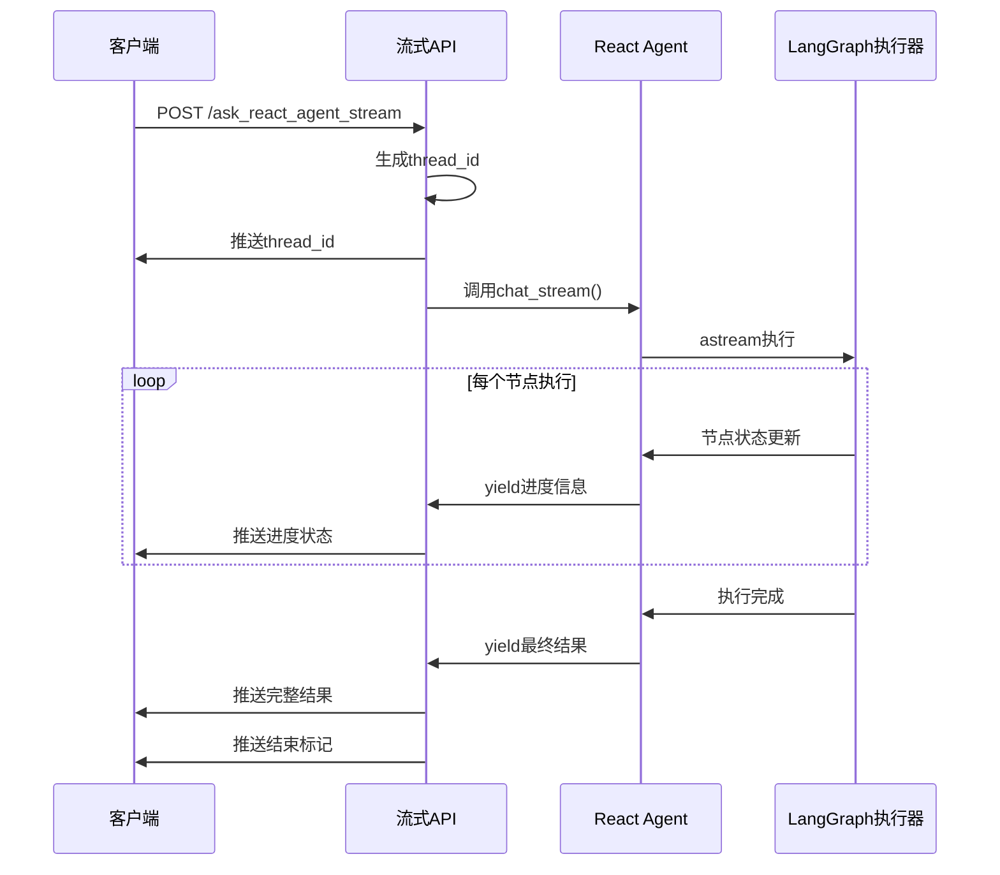

# React Agent 流式API设计方案

## 概述

本文档描述了React Agent流式状态监控API的设计方案，解决当前同步API无法显示执行进度的问题。通过新增流式API，在保持现有API不变的前提下，为客户端提供实时的执行状态监控能力。

## 背景问题

### 当前API的局限性

当前的 `ask_react_agent` API存在以下问题：

1. **同步执行**：客户端必须等待整个Agent执行完成
2. **无进度显示**：客户端无法了解当前执行状态
3. **用户体验差**：长时间等待没有任何反馈

### 用户需求

- 立即获得 `thread_id` 用于标识对话
- 实时显示Agent执行进度（如"AI思考中"、"执行查询"等）
- 保持现有API的兼容性

## 解决方案

### 设计原则

1. **向后兼容**：现有 `ask_react_agent` API保持完全不变
2. **最小侵入**：尽可能复用现有代码逻辑
3. **统一格式**：新API与现有API保持相同的响应格式
4. **实时性**：基于LangGraph原生的流式能力

### 技术方案

#### 1. 新增流式API

**端点**：`POST /api/v0/ask_react_agent_stream`

**技术栈**：
- 基于 LangGraph 的 `astream` 功能
- 使用 Server-Sent Events (SSE) 推送状态
- 保持统一的标准API响应格式

#### 2. 执行流程



## 实现方案

### 1. 修改 `react_agent/agent.py`

**新增方法**：`chat_stream()`

```python
async def chat_stream(self, message: str, user_id: str, thread_id: Optional[str] = None):
    """
    流式处理用户聊天请求 - 复用chat()方法的所有逻辑
    """
    # 1. 复用现有的初始化逻辑
    if not thread_id:
        now = pd.Timestamp.now()
        milliseconds = int(now.microsecond / 1000)
        thread_id = f"{user_id}:{now.strftime('%Y%m%d%H%M%S')}{milliseconds:03d}"
    
    # 2. 复用现有的配置和错误处理
    self._recursion_count = 0
    run_config = {
        "configurable": {"thread_id": thread_id},
        "recursion_limit": config.RECURSION_LIMIT
    }
    
    # 3. 复用checkpointer检查逻辑
    if self.checkpointer:
        # ... checkpointer连接检查和重新初始化 ...
    
    # 4. 使用astream流式执行
    final_state = None
    async for chunk in self.agent_executor.astream(inputs, run_config, stream_mode="updates"):
        for node_name, node_data in chunk.items():
            yield {
                "type": "node_progress",
                "node": node_name,
                "data": node_data,
                "thread_id": thread_id
            }
            final_state = node_data
    
    # 5. 复用现有的结果处理逻辑
    if final_state and "messages" in final_state:
        api_data = await self._async_generate_api_data(final_state)
        yield {
            "type": "final_result",
            "result": {"api_data": api_data, "thread_id": thread_id}
        }
```

**关键特性**：
- 完全复用 `chat()` 方法的初始化和错误处理逻辑
- 使用 `astream` 而非 `ainvoke` 获取每个节点状态
- 通过生成器模式实时yield状态信息

### 2. 修改 `unified_api.py`

**新增API端点**：`ask_react_agent_stream()`

```python
@app.route("/api/v0/ask_react_agent_stream", methods=["POST"])
async def ask_react_agent_stream():
    """React Agent 流式API"""
    
    async def generate():
        try:
            # 复用现有的数据验证逻辑
            data = request.get_json(force=True)
            validated_data = validate_request_data(data)
            
            # 复用现有的Agent初始化检查
            if not await ensure_agent_ready():
                yield error_response()
                return
            
            # 流式执行
            async for chunk in _react_agent_instance.chat_stream(
                message=validated_data['question'],
                user_id=validated_data['user_id'],
                thread_id=validated_data.get('thread_id')
            ):
                if chunk["type"] == "node_progress":
                    yield format_progress_message(chunk)
                elif chunk["type"] == "final_result":
                    yield format_final_result(chunk, validated_data)
                elif chunk["type"] == "error":
                    yield format_error_message(chunk)
            
        except Exception as e:
            yield format_exception(e)
    
    return Response(generate(), mimetype='text/event-stream')
```

### 3. 响应格式设计

#### 进度状态消息

```json
{
  "code": 200,
  "success": true,
  "message": "正在执行: AI思考中",
  "data": {
    "type": "progress",
    "node": "agent",
    "display_name": "AI思考中",
    "icon": "🤖",
    "thread_id": "wang1:20250131103000001",
    "timestamp": "2025-01-31T10:30:00"
  }
}
```

#### 最终结果消息

```json
{
  "code": 200,
  "success": true,
  "message": "处理成功",
  "data": {
    "type": "completed",
    "response": "根据销售数据分析...",
    "conversation_id": "wang1:20250131103000001",
    "user_id": "wang1",
    "react_agent_meta": {...},
    "sql": "SELECT * FROM sales...",
    "records": [...],
    "timestamp": "2025-01-31T10:32:15"
  }
}
```

#### 节点状态映射

| 节点名称 | 显示名称 | 图标 | 说明 |
|----------|----------|------|------|
| `__start__` | 开始 | 🚀 | 流程启动 |
| `trim_messages` | 准备中 | 📝 | 消息裁剪 |
| `agent` | AI思考中 | 🤖 | LLM推理决策 |
| `prepare_tool_input` | 准备工具 | 🔧 | 工具输入准备 |
| `tools` | 执行查询 | ⚙️ | SQL工具执行 |
| `update_state_after_tool` | 处理结果 | 🔄 | 结果处理 |
| `format_final_response` | 生成回答 | 📝 | 最终响应格式化 |
| `__end__` | 完成 | ✅ | 流程结束 |

## 前端集成

### 现有API（保持不变）

```javascript
// 同步方式 - 适合不需要显示进度的场景
const response = await fetch('/api/v0/ask_react_agent', {
    method: 'POST',
    headers: {'Content-Type': 'application/json'},
    body: JSON.stringify({question, user_id})
});

const result = await response.json();
displayResult(result.data);
```

### 流式API

```javascript
// 流式方式 - 适合需要显示进度的场景
const eventSource = new EventSource('/api/v0/ask_react_agent_stream', {
    method: 'POST',
    headers: {'Content-Type': 'application/json'},
    body: JSON.stringify({question, user_id})
});

let threadId = null;

eventSource.onmessage = function(event) {
    const data = JSON.parse(event.data);
    
    switch(data.data.type) {
        case 'progress':
            updateProgress(`${data.data.icon} ${data.data.display_name}`);
            if (!threadId) threadId = data.data.thread_id;
            break;
            
        case 'completed':
            hideProgress();
            displayResult(data.data);  // 格式与现有API完全一致
            eventSource.close();
            break;
            
        case 'error':
            hideProgress();
            showError(data.message);
            eventSource.close();
            break;
    }
};
```

## API测试

### Postman测试流式API

**Postman完全支持测试SSE流式API**：

#### 测试配置

1. **Method**: `POST`
2. **URL**: `http://localhost:8084/api/v0/ask_react_agent_stream`
3. **Headers**:
   ```
   Content-Type: application/json
   Accept: text/event-stream
   ```
4. **Body** (JSON):
   ```json
   {
     "question": "帮我查询销售数据",
     "user_id": "test_user"
   }
   ```

#### 预期响应

Postman会逐步显示流式响应：

```
data: {"code":200,"success":true,"message":"任务已启动","data":{"type":"started","thread_id":"test_user:20250131..."}}

data: {"code":200,"success":true,"message":"正在执行: AI思考中","data":{"type":"progress","display_name":"AI思考中","icon":"🤖"}}

data: {"code":200,"success":true,"message":"正在执行: 执行查询","data":{"type":"progress","display_name":"执行查询","icon":"⚙️"}}

data: {"code":200,"success":true,"message":"处理成功","data":{"type":"completed","response":"...","conversation_id":"test_user:20250131..."}}
```

#### 测试要点

**适合测试**：
- ✅ SSE格式是否正确
- ✅ JSON结构验证
- ✅ 错误情况处理
- ✅ 流式事件序列

**局限性**：
- ❌ 无法测试前端EventSource逻辑
- ❌ 显示原始SSE格式，不够直观

## 技术优势

### 1. 向后兼容性

- **现有API完全不变**：`ask_react_agent` 保持所有现有功能
- **响应格式一致**：最终结果与现有API格式完全相同
- **代码复用**：复用所有现有的验证、格式化、错误处理逻辑

### 2. 实时性能

- **基于LangGraph原生能力**：利用 `astream` 获取真实的节点执行状态
- **零延迟推送**：每个节点执行时立即推送状态
- **无需轮询**：Server-Sent Events 实现实时推送

### 3. 用户体验

- **立即响应**：客户端立即获得 `thread_id`
- **进度可视化**：实时显示执行进度和当前步骤
- **错误及时反馈**：执行异常时立即通知客户端

## 实施计划

### 阶段1：核心功能开发
- [ ] 在 `react_agent/agent.py` 中新增 `chat_stream()` 方法
- [ ] 在 `unified_api.py` 中新增流式API端点
- [ ] 实现节点状态映射和响应格式化

### 阶段2：测试验证
- [ ] 单元测试：验证流式方法的正确性
- [ ] 集成测试：验证API端到端功能
- [ ] 性能测试：验证流式推送性能

### 阶段3：文档和部署
- [ ] 更新API文档
- [ ] 前端集成示例
- [ ] 生产环境部署

## 风险评估

### 低风险
- **现有功能影响**：新增功能，现有API完全不变
- **代码质量**：大量复用现有逻辑，风险较低

### 需要注意
- **异步处理**：确保所有异步调用正确处理
- **错误传播**：确保Agent内部错误正确传递到API层
- **资源管理**：长连接的资源清理和超时处理

## 总结

本方案通过新增流式API的方式，在保持现有系统稳定性的前提下，为React Agent提供了实时状态监控能力。方案具有以下特点：

1. **最小侵入**：只需新增代码，不修改现有逻辑
2. **用户友好**：提供类似ChatGPT的实时反馈体验
3. **技术先进**：基于LangGraph原生流式能力
4. **易于维护**：统一的响应格式和错误处理

该方案为React Agent的用户体验升级提供了完整的技术解决方案。

---

*本文档描述了React Agent流式API的完整设计方案，为实际开发提供详细的技术规范。*