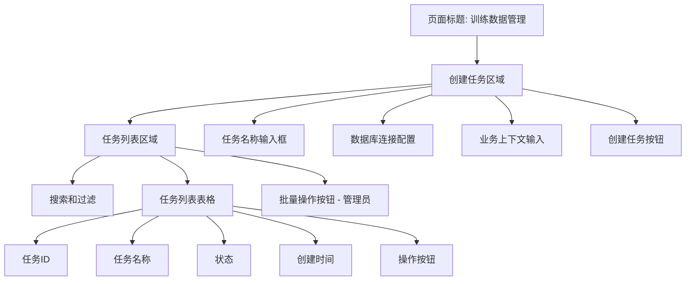
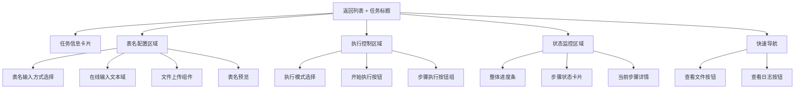
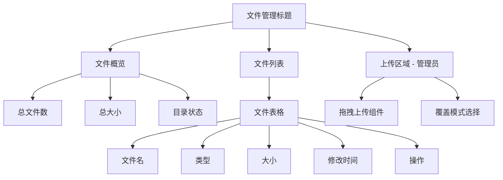
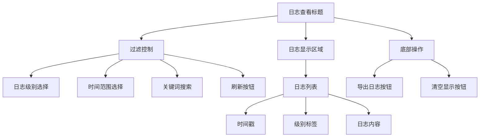
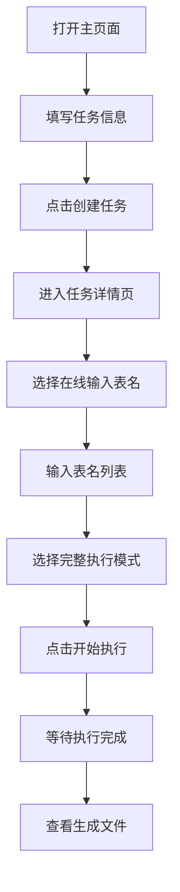
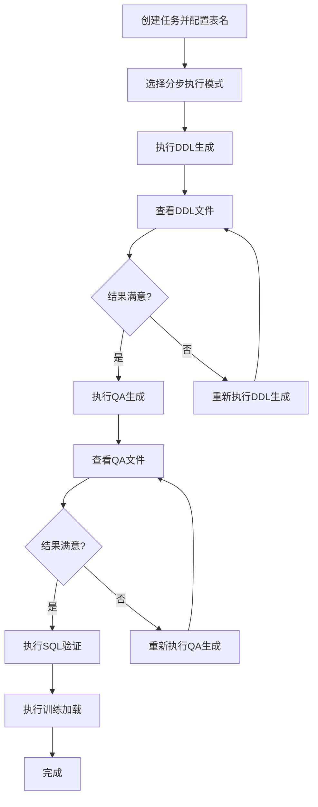

# 训练数据管理 WebUI 设计文档

## 概述

本文档描述训练数据管理系统的Web用户界面设计方案，旨在为用户提供简洁易用的训练数据集创建、执行和管理功能。整个系统围绕四个核心步骤展开：DDL/MD生成、Question-SQL生成、SQL验证和训练数据加载。

## 系统设计原则

### UI设计原则
- **简洁优先**：界面元素精简，减少用户认知负担
- **流程引导**：清晰的步骤指示和进度反馈
- **状态可视**：实时显示任务执行状态和结果
- **操作便捷**：支持快速创建和一键执行

### 技术原则
- **API驱动**：所有操作基于REST API实现
- **异步处理**：长时间任务采用轮询方式获取状态
- **错误友好**：清晰的错误提示和恢复指导

## 页面架构设计

### 整体布局
```
┌─────────────────────────────────────────┐
│                导航栏                   │
├─────────────────────────────────────────┤
│                                         │
│              主要内容区                  │
│                                         │
└─────────────────────────────────────────┘
```

### 页面结构
- **主页面**：任务创建和列表管理
- **任务详情页**：执行控制和状态监控
- **文件管理页**：查看和下载生成文件
- **日志查看页**：执行日志和错误诊断

## 核心页面设计

### 1. 主页面 - 任务管理

#### 功能概述
- 创建新的训练数据任务
- 查看历史任务列表
- 任务状态一览和快速操作

#### 页面布局设计



#### 控件详细设计

**创建任务表单**
- **任务名称**：单行文本输入框，必填，默认"训练数据任务_[时间戳]"
- **数据库连接**：单行文本输入框，必填，占位符显示连接串格式
- **业务上下文**：多行文本输入框，必填，描述业务场景用于LLM理解
- **创建按钮**：主要按钮，触发任务创建API

**任务列表表格**
- **任务ID**：链接，点击进入任务详情页
- **任务名称**：普通文本
- **状态标签**：
  - 待处理 (pending) - 灰色
  - 执行中 (in_progress) - 蓝色
  - 已完成 (completed) - 绿色
  - 失败 (failed) - 红色
- **创建时间**：格式化显示
- **操作**：
  - 查看详情（按钮）
  - 删除（按钮，管理员）

#### API集成点
- `POST /api/v0/data_pipeline/tasks` - 创建任务
- `GET /api/v0/data_pipeline/tasks` - 获取任务列表
- `DELETE /api/v0/data_pipeline/tasks` - 删除任务（管理员）

### 2. 任务详情页 - 执行控制

#### 功能概述
- 提供表名列表（在线输入或文件上传）
- 选择执行模式（完整/分步）
- 监控任务执行状态
- 管理生成的文件

#### 页面布局设计



#### 控件详细设计

**任务信息卡片**
- 任务ID、名称、创建时间
- 数据库连接信息
- 业务上下文描述

**表名配置区域**
- **方式选择**：单选按钮组（在线输入/文件上传）
- **在线输入**：多行文本域，支持逗号分隔的表名
- **文件上传**：拖拽上传组件，支持.txt文件
- **表名预览**：只读列表，显示解析后的表名

**执行控制区域**
- **模式选择**：单选按钮组
  - 完整执行：一次性执行四个步骤
  - 分步执行：手动控制每个步骤
- **执行按钮**：
  - 完整模式：单个"开始执行"按钮
  - 分步模式：四个步骤按钮（根据依赖关系启用/禁用）

**状态监控区域**
- **整体进度条**：显示总体完成百分比
- **步骤卡片**：四个卡片，每个显示：
  - 步骤名称和描述
  - 状态图标和文字
  - 执行时间
  - 错误信息（如有）

#### API集成点
- `POST /api/v0/data_pipeline/tasks/{task_id}/table-list` - 提交表名
- `POST /api/v0/data_pipeline/tasks/{task_id}/upload-table-list` - 上传表名文件
- `POST /api/v0/data_pipeline/tasks/{task_id}/execute` - 执行任务
- `GET /api/v0/data_pipeline/tasks/{task_id}` - 获取任务状态（轮询）

### 3. 文件管理页 - 结果查看

#### 功能概述
- 查看任务生成的所有文件
- 下载特定文件
- 上传修改后的文件（管理员）

#### 页面布局设计



#### 控件详细设计

**文件列表表格**
- **文件名**：按类型分组显示，支持搜索
- **文件类型**：图标+标签显示（DDL/MD/JSON/LOG等）
- **文件大小**：人性化格式显示
- **修改时间**：相对时间+绝对时间
- **操作**：下载按钮

**文件分类显示**
- DDL文件：建表语句文件
- MD文档：表结构说明文档
- JSON数据：问答对训练数据
- 日志文件：执行日志和验证报告

#### API集成点
- `GET /api/v0/data_pipeline/tasks/{task_id}/files` - 获取文件列表
- `GET /api/v0/data_pipeline/tasks/{task_id}/files/{file_name}` - 下载文件
- `POST /api/v0/data_pipeline/tasks/{task_id}/files` - 上传文件（管理员）

### 4. 日志查看页 - 执行监控

#### 功能概述
- 实时查看任务执行日志
- 按日志级别过滤
- 错误诊断和排查

#### 页面布局设计



#### 控件详细设计

**过滤控制栏**
- **日志级别**：多选复选框（INFO/WARNING/ERROR）
- **时间范围**：快捷选择按钮（最近1小时/今天/全部）
- **关键词搜索**：实时搜索输入框
- **自动刷新**：开关按钮，控制是否自动轮询

**日志显示区域**
- **虚拟滚动**：支持大量日志的高性能显示
- **级别标识**：不同颜色的标签
- **时间格式**：显示相对时间，hover显示绝对时间
- **内容格式**：支持换行和长文本折叠

#### API集成点
- `GET /api/v0/data_pipeline/tasks/{task_id}/logs` - 获取日志（支持分页和过滤）

## 用户操作流程设计

### 流程1：快速创建训练数据（推荐）



### 流程2：分步控制执行（高级用户）



## 响应式设计考虑

### 桌面端（推荐）
- 最小宽度：1200px
- 多列布局，充分利用屏幕空间
- 表格支持水平滚动

### 平板端
- 适配768px-1199px宽度
- 自适应列布局
- 表格优化显示

### 手机端（基础支持）
- 单列布局
- 卡片式展示替代表格
- 简化操作流程

## 状态管理设计

### 页面状态
- **任务创建状态**：表单验证、提交状态
- **执行状态**：各步骤的执行状态和进度
- **文件状态**：文件列表、上传状态
- **日志状态**：过滤条件、自动刷新状态

### 数据轮询策略
- **任务状态**：每5秒轮询一次
- **日志数据**：自动刷新时每3秒轮询
- **文件列表**：步骤完成后自动刷新

## 错误处理设计

### 用户友好的错误提示
- **网络错误**：显示重试按钮
- **权限错误**：显示联系管理员提示
- **数据错误**：显示具体错误信息和修正建议
- **系统错误**：显示错误ID便于技术支持

### 错误恢复机制
- **自动重试**：网络临时故障自动重试
- **手动重试**：提供重试按钮
- **状态回滚**：失败后恢复到上一个稳定状态

## 性能优化建议

### 前端优化
- **懒加载**：文件列表和日志按需加载
- **虚拟滚动**：处理大量日志数据
- **缓存策略**：任务列表和状态信息适度缓存
- **防抖处理**：搜索和过滤操作防抖

### 用户体验优化
- **加载状态**：所有异步操作显示加载指示器
- **进度反馈**：长时间操作显示进度条
- **操作确认**：危险操作需要用户确认
- **快捷键支持**：常用操作支持键盘快捷键

## 技术实现建议

### 前端技术栈
- **框架**：React/Vue.js 等现代前端框架
- **状态管理**：Redux/Vuex 管理复杂状态
- **UI组件库**：Ant Design/Element UI 快速开发
- **HTTP客户端**：Axios 处理API调用

### 关键技术点
- **WebSocket**：考虑用于实时状态推送（可选）
- **文件上传**：支持拖拽和进度显示
- **表格组件**：支持排序、过滤、分页
- **代码高亮**：SQL和JSON内容语法高亮

## 管理员功能说明

以下功能仅限管理员使用，需在相应UI元素上添加"管理员"标识：

### 主页面管理功能
- **批量删除任务**：选择多个任务进行批量删除
- **任务状态管理**：强制修改任务状态（高级）

### 文件管理功能
- **文件上传**：上传修改后的训练数据文件
- **文件删除**：删除指定文件（危险操作）

### 系统管理功能
- **清理旧任务**：自动清理30天前的任务目录
- **系统状态监控**：查看系统资源使用情况

## 总结

本设计文档提供了训练数据管理WebUI的完整设计方案，重点关注用户体验和API集成。通过简洁的界面设计、清晰的操作流程和完善的错误处理，用户可以轻松完成训练数据集的创建、执行和管理工作。

设计遵循现代Web应用的最佳实践，支持响应式布局和渐进式功能增强，能够满足不同用户群体的使用需求。 