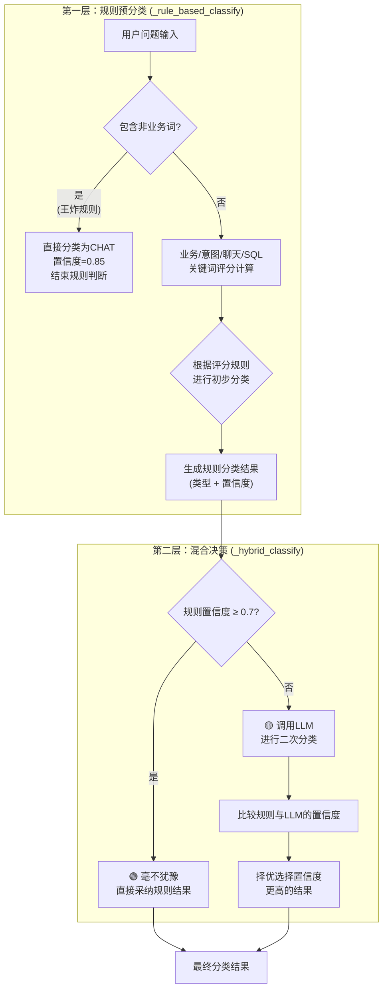

# 问题分类器规则判断逻辑详解

## 概述

问题分类器(`QuestionClassifier`)是Citu智能数据问答平台的核心组件，负责将用户问题分类为`DATABASE`（数据库查询）或`CHAT`（聊天对话）类型。本文档详细解释其基于规则的分类逻辑和评分机制。

## 分类流程概览


## 1. 关键词定义体系

### 1.0 关键词类型总览

问题分类器定义了 **8种关键词类型**，用于不同的分类判断：

| 序号 | 关键词类型 | 数据结构 | 权重/作用 | 数量 | 定义位置 |
|------|------------|----------|-----------|------|----------|
| 1 | **强业务关键词** | 字典(6个子类别) | 混合权重 | 65个 | `classifier.py:49-79` |
| 2 | **查询意图关键词** | 列表 | +1分/词 | 25个 | `classifier.py:81-87` |
| 3 | **非业务实体词** | 列表 | 立即CHAT(0.85) | ~80个 | `classifier.py:91-122` |
| 4 | **SQL模式** | 正则表达式列表 | +3分/匹配 | 2个 | `classifier.py:126-129` |
| 5 | **聊天关键词** | 列表 | +1分/词 | 17个 | `classifier.py:132-136` |
| 6 | **追问关键词** | 列表 | 上下文判断 | 16个 | `classifier.py:139-143` |
| 7 | **话题切换关键词** | 列表 | 上下文判断 | 12个 | `classifier.py:146-150` |
| 8 | **业务上下文文件** | 外部文本 | LLM分类辅助 | 1个文件 | `tools/db_query_decision_prompt.txt` |

### 1.1 强业务关键词与业务实体词的关系

**关键概念区分**：


**包含关系说明**：
- **强业务关键词** = 总概念（6个子类别）
- **业务实体词** = 强业务关键词 - 系统查询指示词（5个子类别）
- **权重差异**：业务实体词(+2分/词) > 系统查询指示词(+1分/词)

**代码实现逻辑**：
```python
# 在 _rule_based_classify 方法中
for category, keywords in self.strong_business_keywords.items():
    if category == "系统查询指示词":  # 系统指示词单独处理
        continue
    for keyword in keywords:
        if keyword in question_lower:
            business_score += 2  # 业务实体词权重更高
```

### 1.2 强业务关键词详细定义 (strong_business_keywords)

这是分类器的核心词库，分为6个业务类别：

#### 核心业务实体 (权重: +2分/词)
- **基础设施**: 服务区、档口、商铺、收费站、高速公路、停车区
- **业务系统**: 驿美、驿购
- **物理分区**: 北区、南区、西区、东区、两区
- **公司相关**: 公司、管理公司、运营公司、驿美运营公司

#### 支付业务 (权重: +2分/词)
- **支付方式全称**: 微信支付、支付宝支付、现金支付、行吧支付、金豆支付
- **业务指标**: 支付金额、订单数量、营业额、收入、营业收入
- **简化形式**: 微信、支付宝、现金、行吧、金豆
- **系统字段**: wx、zfb、rmb、xs、jd

#### 经营品类 (权重: +2分/词)
- **品类**: 餐饮、小吃、便利店、整体租赁
- **品牌**: 驿美餐饮、品牌、经营品类、商业品类

#### 车流业务 (权重: +2分/词)
- **流量概念**: 车流量、车辆数量、车辆统计、流量统计
- **车型分类**: 客车、货车、过境、危化品、城际
- **分析概念**: 车型分布

#### 地理路线 (权重: +2分/词)
- **具体线路**: 大广、昌金、昌栗
- **概念词**: 线路、路段、路线、高速线路、公路线路

#### 系统查询指示词 (权重: +1分/词，特殊处理)
- **系统指示**: 当前系统、当前数据库、当前数据、数据库、本系统、系统
- **数据指示**: 数据库中、数据中、现有数据、已有数据、存储的数据
- **平台指示**: 平台数据、我们的数据库、这个系统

### 1.2 查询意图关键词 (query_intent_keywords)

用于识别数据查询意图，权重: +1分/词

- **统计分析**: 统计、查询、分析、报表、报告、汇总、计算、对比
- **排序概念**: 排行、排名、趋势、占比、百分比、比例
- **聚合函数**: 最大、最小、最高、最低、平均、总计、合计、累计、求和、求平均
- **输出动作**: 生成、导出、显示、列出、共有

### 1.3 SQL模式匹配 (sql_patterns)

使用正则表达式匹配SQL语句特征，权重: +3分/匹配

- **SQL关键字**: `select|from|where|group by|order by|having|join|update`
- **数据库概念**: `数据库|表名|表|字段名|SQL|sql|database|table`

### 1.4 非业务实体词 (non_business_keywords)

**定义位置**: `agent/classifier.py` 第91-122行

**处理机制**: 一旦匹配，直接分类为CHAT，置信度0.85（**最高优先级判断**）

**具体分类**:
- **农产品/食物**: 荔枝、苹果、西瓜、水果、蔬菜、大米、小麦、橙子、香蕉、葡萄、草莓、樱桃、桃子、梨
- **技术概念**: 人工智能、机器学习、编程、算法、深度学习、AI、神经网络、模型训练、数据挖掘
- **身份询问**: 你是谁、你是什么、你叫什么、你的名字、你是什么AI、什么模型、大模型、AI助手、助手、机器人
- **天气相关**: 天气、气温、下雨、晴天、阴天、温度、天气预报、气候、降雨、雪天
- **生活常识**: 怎么做饭、如何减肥、健康、医疗、病症、历史、地理、文学、电影、音乐、体育、娱乐、游戏、小说、新闻、政治、战争、足球、NBA、篮球、乒乓球、冠军、夺冠、高考
- **旅游出行**: 旅游、景点、门票、酒店、机票、航班、高铁、的士
- **情绪表达**: 伤心、开心、无聊、生气、孤独、累了、烦恼、心情、难过、抑郁
- **商业金融**: 股票、基金、理财、投资、经济、通货膨胀、上市
- **哲学思考**: 人生意义、价值观、道德、信仰、宗教、爱情
- **地理范围**: 全球、全国、亚洲、发展中、欧洲、美洲、东亚、东南亚、南美、非洲、大洋

### 1.5 聊天关键词 (chat_keywords)

**定义位置**: `agent/classifier.py` 第132-136行

**处理机制**: 倾向于聊天分类，权重: +1分/词

**具体分类**:
- **问候语**: 你好啊、谢谢、再见
- **疑问词**: 怎么样、如何、为什么、什么是
- **帮助请求**: 介绍、解释、说明、帮助、操作、使用方法、功能、教程、指南、手册、讲解

### 1.6 追问关键词 (follow_up_keywords)

**定义位置**: `agent/classifier.py` 第139-143行

**处理机制**: 用于检测追问型问题，在渐进式分类中起上下文判断作用

**具体分类**:
- **延续词**: 还有、详细、具体、更多、继续、再、也
- **连接词**: 那么、另外、其他、以及、还、进一步
- **补充词**: 深入、补充、额外、此外、同时、并且

### 1.7 话题切换关键词 (topic_switch_keywords)

**定义位置**: `agent/classifier.py` 第146-150行

**处理机制**: 检测明显的话题转换，避免错误继承上下文类型

**具体分类**:
- **问候开场**: 你好、你是、谢谢、再见
- **功能询问**: 介绍、功能、帮助、使用方法
- **系统询问**: 平台、系统、AI、助手

### 1.8 业务上下文文件 (外部文本)

**定义位置**: `agent/tools/db_query_decision_prompt.txt`

**处理机制**: 为LLM分类提供详细的业务范围描述

**内容概要**:
- 核心业务实体定义
- 关键业务指标说明  
- 高速线路信息
- 数据库业务范围界定

## 2. 评分机制详解

### 2.1 评分计算流程

```python
# 1. 业务实体评分 (business_score)
for 每个业务类别:
    if 类别 != "系统查询指示词":
        for 每个关键词:
            if 关键词 in 问题:
                business_score += 2

# 2. 系统指示词评分 (system_indicator_score)
for 每个系统查询指示词:
    if 关键词 in 问题:
        system_indicator_score += 1

# 3. 查询意图评分 (intent_score)
for 每个查询意图词:
    if 关键词 in 问题:
        intent_score += 1

# 4. SQL模式评分
for 每个SQL正则模式:
    if 模式匹配:
        business_score += 3

# 5. 聊天关键词评分 (chat_score)
for 每个聊天关键词:
    if 关键词 in 问题:
        chat_score += 1
```

### 2.2 组合评分逻辑

系统指示词具有特殊的组合效应：

```python
if system_indicator_score > 0 and business_score > 0:
    # 系统指示词 + 业务实体 = 强组合效应
    business_score += 3  # 组合加分
elif system_indicator_score > 0:
    # 仅有系统指示词 = 中等业务倾向
    business_score += 1
```

**设计理念**: 
- 当用户说"当前系统有哪些服务区"时，"当前系统"(+1) + "服务区"(+2) + 组合加分(+3) = 总计6分
- 仅有"当前系统"时，只加1分，表示轻微的数据查询倾向

## 4. 混合决策流程与阈值机制

分类器的核心决策逻辑并非单一的规则判断，而是一个分为两个阶段的混合流程，旨在平衡效率与准确性。

### 4.1 决策流程图

此流程图准确地描述了代码中的两层决策逻辑：首先是高效的**规则预分类**，然后是根据置信度决定是否启动**LLM二次研判**的**混合决策**。



### 4.2 流程阶段详解

1.  **第一层：规则预分类 (`_rule_based_classify`方法)**
    *   **非业务词优先判断**: 这是最高优先级的“王炸规则”。系统首先检查问题是否包含“非业务实体词”（如“苹果”、“天气”）。如果匹配，则**立即将其分类为`CHAT`并赋予0.85的高置信度**，后续所有评分和判断流程都将被跳过。
    *   **关键词评分**: 如果没有匹配到非业务词，系统会根据业务、意图、聊天、SQL模式等多种关键词进行综合评分。
    *   **生成初步结果**: 根据评分规则，系统会得出一个初步的分类（`DATABASE`或`CHAT`）以及对应的置信度，形成`rule_result`。

2.  **第二层：混合决策 (`_hybrid_classify`方法)**
    *   **高置信度捷径**: `_hybrid_classify`方法接收到第一层的`rule_result`后，首先检查其置信度。如果**置信度大于等于`0.7`**，表明规则分类已经非常有把握，系统会直接采纳该结果，**不再调用LLM**，从而实现高效决策。
    *   **LLM二次研判**: 如果规则置信度低于`0.7`，说明情况比较模糊或规则不足以做出高可信度判断，系统会启动LLM进行更深层次的语义理解和分类，得到`llm_result`。
    *   **择优录取**: 最后，系统会比较`rule_result`和`llm_result`的置信度，选择**置信度更高的一方**作为最终的分类结果。这种机制确保了即使规则分类的把握不大，也能通过LLM进行补足，同时在LLM判断不准时，仍能依赖保底的规则结果。

### 4.3 设计理念与关键阈值

*   **成本与效率的平衡**: 设置`0.7`作为高置信度阈值，是在API调用成本和决策速度之间取得的平衡。对于绝大多数意图明确的问题，可以通过高效的规则快速解决，避免了不必要的LLM调用。
*   **准确性的双重保障**: 对于意图模糊的边界案例，通过引入LLM作为“第二意见”，可以显著提升分类的准确率和鲁棒性。
*   **强制优先级**: “非业务词”规则的设计，确保了系统不会错误地尝试去查询明显与业务无关的问题，提升了用户体验。
*   **鲁棒性：通过组合门槛拦截无效查询**: 当前的评分机制并非简单的分数累加，而是设立了“组合门槛”。例如，“强业务特征”要求`business_score`和`intent_score`**同时满足**最低要求。这种设计的核心价值在于，它可以精准地阻挡那些**“有查询意图，但查询对象并非业务范畴”**的无效问题。例如，对于问题`“分析汇总我这个月的花费”`，尽管“分析”、“汇总”有很高的意图分，但由于“花费”不是业务关键词，导致`business_score`为0，无法通过任何数据库查询的门槛，从而被正确地识别为不确定问题，避免了错误的数据库查询。这套机制确保了只有意图和业务主体有效组合的问题才能被处理，大大提升了系统的鲁棒性。

#### 关键阈值表

| 置信度范围 | 决策行为 | 代码位置 | 说明 |
|------------|----------|----------|------|
| **非业务词匹配** | 🔴 直接CHAT，置信度=0.85 | `classifier.py:231-238` | 最高优先级，立即决策 |
| **≥ 0.7** | 🟢 毫不犹豫使用规则结果 | `classifier.py:171-173` | 高置信度，不调用LLM |
| **< 0.7** | 🟡 规则+LLM双重判断 | `classifier.py:175-182` | 取置信度更高者 |

### 4.4 决策示例分析

#### 示例1：毫不犹豫决策 (≥0.7)
```
问题: "统计服务区的微信支付金额"
规则分类: DATABASE, 置信度=0.9
决策: 直接使用规则结果，不调用LLM ✓
```

#### 示例2：双重判断 (<0.7)
```
问题: "服务区情况"
规则分类: DATABASE, 置信度=0.6
LLM分类: DATABASE, 置信度=0.8
决策: 选择LLM结果 (0.8 > 0.6) ✓
```

#### 示例3：非业务词王炸
```
问题: "苹果什么时候成熟"
非业务词: 苹果 ✓
决策: 直接CHAT，置信度=0.85，跳过所有其他判断 ✓
```

## 5. 配置参数说明

### 5.1 核心阈值参数

| 参数名 | 默认值 | 范围 | 说明 |
|--------|--------|------|------|
| `high_confidence_threshold` | 0.7 | 0.7-0.9 | 高置信度阈值，超过则直接使用规则结果 |
| `low_confidence_threshold` | 0.4 | 0.2-0.5 | 低置信度阈值，低于则启用LLM辅助 |
| `max_confidence` | 0.9 | 0.8-1.0 | 最大置信度上限，防止过度自信 |
| `base_confidence` | 0.4 | 0.3-0.6 | 基础置信度，聊天分类的起始值 |
| `confidence_increment` | 0.08 | 0.05-0.2 | 置信度增量步长 |
| `uncertain_confidence` | 0.2 | 0.1-0.3 | 不确定分类的置信度 |

### 5.2 评分权重体系

| 关键词类型 | 权重 | 用途 | 说明 |
|------------|------|------|------|
| **业务实体词** | +2分/词 | 规则评分 | 核心业务概念，强业务关键词的主要部分 |
| **系统指示词** | +1分/词 | 规则评分 | 系统查询指示，权重低于业务实体词 |
| **查询意图词** | +1分/词 | 规则评分 | 数据查询意图，辅助判断 |
| **SQL模式** | +3分/匹配 | 规则评分 | 技术查询特征，权重最高 |
| **聊天关键词** | +1分/词 | 规则评分 | 聊天交互意图 |
| **非业务实体词** | 立即CHAT(0.85) | 直接分类 | 最高优先级，跳过所有评分 |
| **追问关键词** | 无直接权重 | 上下文判断 | 检测追问型问题 |
| **话题切换关键词** | 无直接权重 | 上下文判断 | 检测话题转换 |
| **组合加分** | +3分 | 特殊逻辑 | 系统词+业务词组合效应 |

## 6. 典型分类示例

### 6.1 DATABASE分类示例

#### 强业务特征 (business_score≥2 + intent_score≥1)
```
问题: "统计服务区的微信支付金额"
匹配:
- 业务实体: 服务区(+2), 微信支付(+2) → business_score=4
- 查询意图: 统计(+1) → intent_score=1
- 总分: 4+1=5
结果: DATABASE, 置信度=min(0.9, 0.8+5*0.05)=0.9
```

#### 中等业务特征 (business_score≥4)
```
问题: "驿美运营公司档口数量"
匹配:
- 业务实体: 驿美运营公司(+2), 档口(+2) → business_score=4
- 查询意图: 无 → intent_score=0
结果: DATABASE, 置信度=min(0.9, 0.7+4*0.03)=0.82
```

### 6.2 CHAT分类示例

#### 非业务实体词
```
问题: "苹果什么时候成熟"
匹配: 苹果(非业务词)
结果: CHAT, 置信度=0.85
```

#### 聊天特征
```
问题: "怎么使用这个平台"
匹配:
- 聊天关键词: 怎么(+1), 使用方法(+1) → chat_score=2
- 业务实体: 无 → business_score=0
结果: CHAT, 置信度=min(0.9, 0.4+2*0.08)=0.56
```

### 6.3 UNCERTAIN分类示例

```
问题: "请问一下"
匹配: 无关键词匹配
结果: UNCERTAIN, 置信度=0.2
```

## 7. 优化建议

### 7.1 当前逻辑的优势
1. **完整的关键词体系**: 8种关键词类型覆盖了规则评分、直接分类、上下文判断等不同维度
2. **明确的优先级**: 非业务词 > 强业务 > 中等业务 > 聊天 > 不确定
3. **精细的权重设计**: 业务实体词(+2) > 系统指示词(+1)，体现业务相关性差异
4. **组合效应**: 系统指示词与业务词的协同加分机制
5. **置信度区分**: 不同条件下的差异化置信度计算
6. **上下文感知**: 追问关键词和话题切换关键词支持渐进式分类
7. **可配置性**: 所有阈值和权重都可调整

### 7.2 潜在优化方向
1. **关键词扩展**: 根据实际业务场景补充关键词库
2. **权重调优**: 基于分类效果数据调整各类词的权重
3. **组合规则**: 增加更多的关键词组合判断逻辑
4. **上下文考虑**: 增强上下文相关性的判断机制
5. **动态阈值**: 根据历史分类准确率动态调整阈值

### 7.3 监控指标
1. **分类准确率**: 各类别的分类正确率
2. **置信度分布**: 高、中、低置信度的分布情况
3. **关键词命中率**: 各关键词的实际使用频率
4. **边界案例**: 接近阈值的分类案例分析

## 8. 技术实现细节

### 8.1 问题预处理
```python
def _extract_current_question_for_rule_classification(self, question: str) -> str:
    """提取当前问题用于规则分类，避免上下文干扰"""
    if "\n[CURRENT]\n" in question:
        current_start = question.find("\n[CURRENT]\n")
        current_question = question[current_start + len("\n[CURRENT]\n"):].strip()
        return current_question
    return question.strip()
```

### 8.2 大小写处理
所有关键词匹配都转换为小写进行，确保大小写不敏感。

### 8.3 正则表达式
SQL模式使用正则表达式匹配，支持单词边界检查，避免子字符串误匹配。

---

*本文档基于 agent/classifier.py 代码分析生成，版本日期: 2024年* 