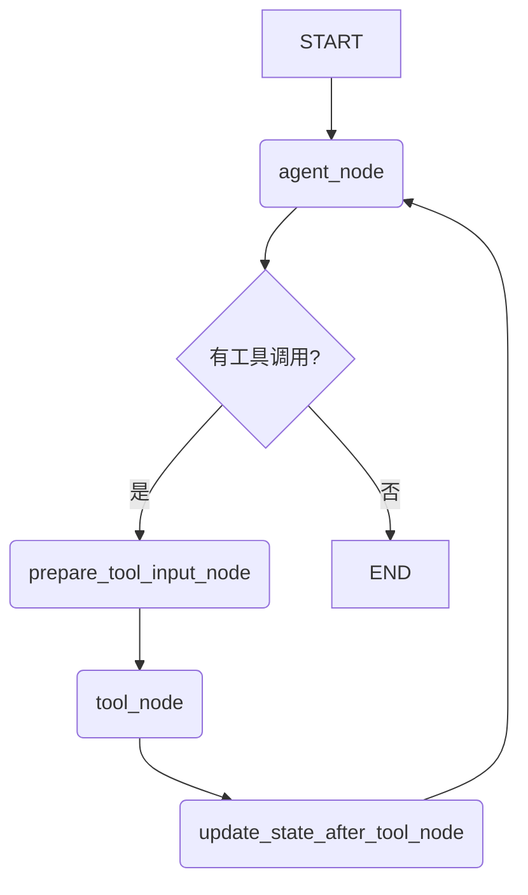

# 紧急求助：LangGraph 中向工具传递包含中文的复杂参数时，遭遇双重JSON编码和序列化错误

大家好，

我们正在使用 LangGraph 构建一个基于 `StateGraph` 的 ReAct Agent，其核心需求是在多轮对话中能够理解并利用上下文生成 SQL 查询。为了实现这一点，我们设计了一个流程，需要将完整的对话历史（`history_messages`）作为参数，传递给我们自定义的 `generate_sql` 工具。

然而，当对话历史中包含中文字符时，我们在 LangChain 的工具调用序列化阶段遇到了一个棘手的 `JSONDecodeError`，似乎是由于双重 JSON 编码或不当的 `\uXXXX` 转义引起的。我们已经尝试了多种方案，但都未能解决。恳请社区的专家们不吝赐教！

---

## 1. 核心目标与架构

我们的目标是让 `generate_sql` 工具能够访问完整的对话历史，以便在处理“这个服务区怎么样？”这类指代性问题时，能够知道“这个服务区”具体指代的是哪一个。

我们的 `StateGraph` 设计如下：



- **`prepare_tool_input_node`**: 这个节点的关键职责是，当检测到 `agent_node` 决定调用 `generate_sql` 时，从 `state` 中提取完整的 `messages` 列表，并将其作为 `history_messages` 参数注入到该工具调用的 `args` 中。

## 2. 遇到的核心问题

当 `prepare_tool_input_node` 成功将 `history_messages`（一个包含 `{'type': 'human', 'content': '你好'}` 这样字典的列表）注入后，图在继续执行时崩溃。

**错误日志如下：**

```
Invalid Tool Calls:
  generate_sql (call_e58f408879664da99cd18d)
 Call ID: call_e58f408879664da99cd18d
  Error: Function generate_sql arguments:

{"question": "\u8bf7\u95ee\u8fd9\u4e2a\u9ad8\u901f...ff1f", "history_messages": [{"type": "human", "content": "\u8bf7\u95ee\u7cfb\u7edf..."}, ...]}

are not valid JSON. Received JSONDecodeError Invalid \escape: line 1 column 1539 (char 1538)
For troubleshooting, visit: https://python.langchain.com/docs/troubleshooting/errors/OUTPUT_PARSING_FAILURE
```

## 3. 我们的问题分析

从日志可以看出，传递给 `generate_sql` 的 `args` 字典，在被序列化时，所有的中文字符都被转换成了 `\uXXXX` 的 ASCII 编码格式。

我们推断，问题根源在于 LangChain 在准备将 `tool_calls` 发送给 LLM API 或进行内部处理时，**强制使用 `json.dumps(..., ensure_ascii=True)` 对 `args` 字典进行了序列化**。当这个已经被编码的、包含大量 `\` 转义符的字符串在后续流程中被再次当作 JSON 解析时，便会因为非法的 `\u` 转义序列而导致 `JSONDecodeError`。这似乎是一种我们无法轻易配置的“双重编码”问题。

## 4. 已尝试的失败方案

1.  **在 `ChatOpenAI` 初始化时设置 `ensure_ascii=False`**:
    - 我们尝试通过 `model_kwargs={"extra_body": {"misc": {"ensure_ascii": False}}}` 来影响序列化行为。
    - **结果**: 这只影响了从 LLM 返回的最终答案的渲染，但**未能改变 LangChain 对工具调用参数的序列化行为**，错误依旧。

2.  **在工具端解码**:
    - 我们尝试在 `generate_sql` 函数内部，对接收到的 `history_messages` 字符串进行 `json.loads()` 或其他形式的解码。
    - **结果**: 失败。因为错误发生在 LangChain 调用我们工具**之前**的序列化阶段，程序流程根本没有机会进入到我们的工具函数内部。

## 5. 寻求帮助的核心问题

我们感觉陷入了一个两难的境地。为了实现上下文感知，我们必须向工具传递复杂的数据；但 LangChain 的序列化机制似乎不允许这样做，尤其是当数据包含非 ASCII 字符时。

我们想请教社区：

1.  **在 LangGraph 中，向工具传递包含非 ASCII 字符的复杂数据结构（如对象或字典列表）的最佳实践到底是什么？**
2.  **是否有任何方法可以覆盖或配置 `ToolNode` 或其底层对 `tool_calls` `args` 的序列化行为，强制其使用 `ensure_ascii=False`？**
3.  如果这条路走不通，是否有其他更优雅、更推荐的设计模式，来解决“需要感知完整对话历史的工具”这一常见的场景？（例如，除了我们正在尝试的“参数注入”模式外，还有没有其他的可能性？）

---

### 附：关键代码片段

**`_prepare_tool_input_node`**:
```python
def _prepare_tool_input_node(self, state: AgentState) -> Dict[str, Any]:
    last_message = state["messages"][-1]
    if not hasattr(last_message, "tool_calls") or not last_message.tool_calls:
        return {}
    
    new_tool_calls = []
    for tool_call in last_message.tool_calls:
        if tool_call["name"] == "generate_sql":
            # 将消息对象列表转换为可序列化的字典列表
            serializable_history = [
                {"type": msg.type, "content": msg.content} 
                for msg in state["messages"]
            ]
            
            modified_args = tool_call["args"].copy()
            modified_args["history_messages"] = serializable_history
            new_tool_calls.append({ # ... 重新构建 tool_call ... })
    
    last_message.tool_calls = new_tool_calls
    return {"messages": [last_message]}
```

**`generate_sql` 工具签名**:
```python
@tool
def generate_sql(question: str, history_messages: List[Dict[str, Any]]) -> str:
    # ...
```

任何建议或思路都将对我们产生巨大的帮助。提前感谢大家！ 