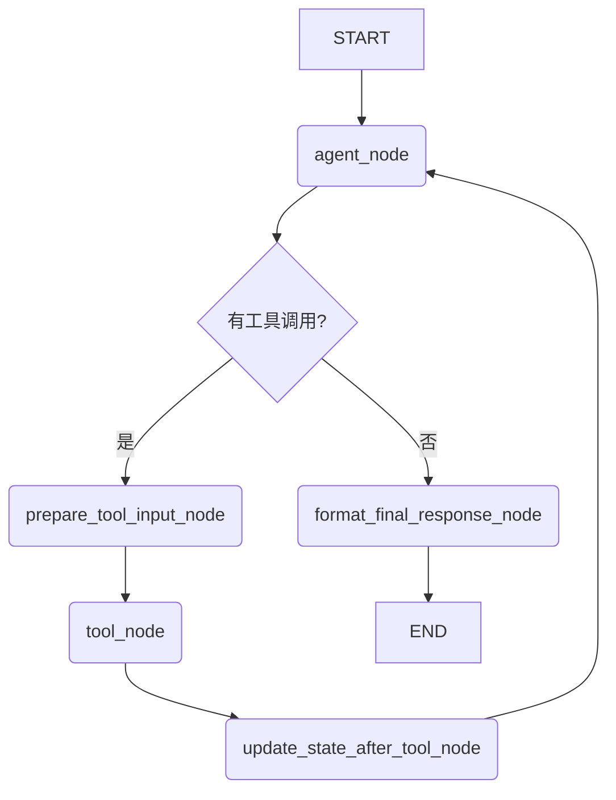

# Custom React Agent 重构概要设计

本文档总结了将原有基于 `create_react_agent` 的 Demo 重构为使用 `StateGraph` 的、具备强大上下文处理能力和流程控制能力的新版 Agent 的概要设计。

## 1. 重构核心目标

- **解决上下文遗忘问题**：确保 Agent 在多轮对话中，尤其是在连续调用 SQL 相关工具时，能够理解并利用之前的对话历史（如上文提到的实体“南城服务区”）。
- **增强流程控制能力**：对 `generate_sql -> valid_sql -> run_sql` 这一固定流程进行强力引导，防止 LLM“忘记”执行下一步或执行错误，提高 Agent 的可靠性和可预测性。
- **提升代码健壮性与可维护性**：通过模块化和清晰的职责划分，使代码更易于理解、调试和扩展。

## 2. 最终 `StateGraph` 架构

新架构的核心是一个包含 5 个节点的 `StateGraph`，它取代了原有的 `create_react_agent` 黑盒。




### 2.1. 节点职责

- **`agent_node` (决策者)**
  - **输入**: 完整的 `state`，包含 `messages` 历史和 `suggested_next_step`。
  - **职责**:
    1.  读取完整的对话历史。
    2.  读取 `state.suggested_next_step` 作为强烈的行动建议 (例如: `valid_sql`, `run_sql`, `analyze_error`)。
    3.  通过提示工程，将建议和历史结合，让 LLM 做出决策。
    4.  **输出**: 一个“草稿版”的 `tool_calls`，或决定直接回答的 `AIMessage`。

- **`prepare_tool_input_node` (信息组装者)** - **(新增节点)**
  - **位置**: `agent_node` 之后, `tool_node` 之前。
  - **职责**:
    1.  检查 `agent_node` 输出的 `tool_calls`。
    2.  如果发现需要上下文的工具（如 `generate_sql`），则从 `state.messages` 中提取完整的对话历史。
    3.  将提取的历史作为 `history_messages` 参数，**注入**到 `tool_calls` 的 `args` 中。
  - **输出**: 一个“精装版”的、包含了完整上下文信息的 `tool_calls`。

- **`tool_node` (执行者)**
  - **职责**: 接收“精装版”的 `tool_calls`，并忠实地调用 `sql_tools.py` 中的工具函数。

- **`update_state_after_tool_node` (流程建议与错误处理器)** - **(新增节点)**
  - **位置**: `tool_node` 之后。
  - **职责**:
    1.  检查刚刚执行的工具名称及其返回结果（成功/失败）。
    2.  根据预设的逻辑，智能地更新 `state.suggested_next_step` 字段，以精确引导下一步：
        - **`generate_sql` 成功**: `suggested_next_step` -> `"valid_sql"`
        - **`generate_sql` 失败**: `suggested_next_step` -> `"answer_with_common_sense"` (引导LLM基于常识回答或向用户解释)
        - **`valid_sql` 成功**: `suggested_next_step` -> `"run_sql"`
        - **`valid_sql` 失败**: `suggested_next_step` -> `"analyze_validation_error"` (引导LLM分析错误原因)
        - **`run_sql` 执行后**: `suggested_next_step` -> `"summarize_final_answer"` (引导LLM基于数据总结)
  - **输出**: 更新后的 `state`。

- **`format_final_response_node` (最终输出格式化器)** - **(新增节点)**
  - **位置**: 在 `agent_node` 决定直接回答后，图结束前。
  - **职责 (v1 - 占位)**:
    1.  **当前阶段**: 仅作为流程占位符，证明流程已正确进入此节点。
    2.  在日志中打印一条明确的信息，如 `"[Node] format_final_response - 准备格式化最终输出..."`。
  - **职责 (未来)**:
    1.  从 `state` 中提取 LLM 的最终文字总结和最近一次 `run_sql` 的数据（如果存在）。
    2.  将数据格式化为 Markdown 表格。
    3.  将文字总结和数据表格合并成一个对用户友好的、结构化的最终答案。
  - **输出**: 更新 `state` 中最后一条 `AIMessage` 的内容。

## 3. `AgentState` 状态设计

`state.py` 文件将定义 `StateGraph` 中流转的数据结构。

```python
from typing import TypedDict, Annotated, Optional, List
from langchain_core.messages import BaseMessage

class AgentState(TypedDict):
    messages: Annotated[List[BaseMessage], add_messages]
    user_id: str
    thread_id: str
    # 新增字段，用于引导 LLM 的下一步行动
    suggested_next_step: Optional[str]
```

- **`messages`**: 核心字段，存储完整的、包含 `HumanMessage`, `AIMessage`, `ToolMessage` 的对话历史。
- **`suggested_next_step`**: 流程控制的关键。它由 `update_state_after_tool_node` 写入，由 `agent_node` 读取，为 LLM 提供强力的流程引导。

## 4. 工具签名与实现

- **`sql_tools.py`**:
  - `generate_sql(question: str, history_messages: List[BaseMessage]) -> str`:
    - 修改其函数签名，明确要求传入 `history_messages`。
    - 在其内部，将 `question` 和 `history_messages` 组合成更丰富的提示，再交给 Vanna 的 LLM 进行处理，从而解决上下文理解问题。
  - `valid_sql` 和 `run_sql` 保持简单的输入输出。

## 5. 日志与持久化

- **日志**: 使用 Python 内置的 `logging` 模块，由 `config.py` 控制级别。在每个节点的入口和出口、关键的逻辑判断处打印详细日志，以便清晰地追踪 Agent 的思考和执行链路。
- **持久化**: 完全复用并保留原有的 `AsyncRedisSaver` 机制。`CustomReactAgent` 在初始化时创建 `checkpointer`，并在编译 `StateGraph` 时传入，以实现自动的状态持久化。

## 6. 优势总结

1.  **双重上下文保障**:
    - **数据上下文**: 通过 `prepare_tool_input_node` 确保 `generate_sql` 能获取完整的对话历史。
    - **流程上下文**: 通过 `update_state_after_tool_node` 和 `suggested_next_step` 确保 Agent 遵循预设的执行流程。
2.  **职责分离**: 每个节点职责单一（决策、准备数据、执行、更新状态），代码清晰，易于维护。
3.  **高度可控与可预测**: 在给予 LLM 思考空间的同时，通过代码逻辑保证了核心流程的稳定性和可靠性。
4.  **易于调试**: 详细的日志输出将使追踪和定位问题变得非常简单。 